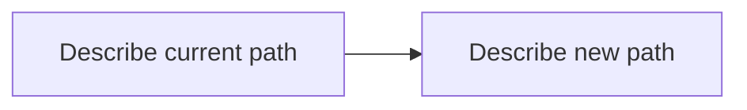
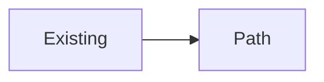
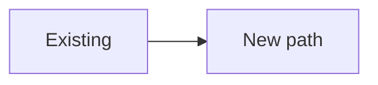

## What changed

-

## Change diagram

<!-- New / additive work: one diagram. Rework: use ### Before and ### After. -->

### Before

### After

## How to QA

- [ ]
- [ ]

## Notes

<!-- Typo-only / diagram-hostile? Say why the diagram section is minimal. -->

## Blast radius and merge danger
- **Blast radius:** <affected surfaces, users/callers, dependencies, and relevant consequences>
- **Door:** <two-way | one-way | mixed | unknown; actual rollback path and limits>
- **Evidence and remaining checks:** <actual verification and limits; unknowns or required checks>
- **Merge danger:** <grounded assessment, reasons, and conditions; never merge permission>
