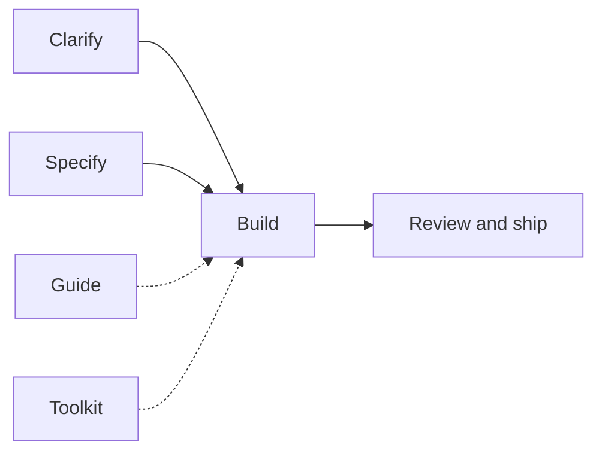

# Gabriel Lafrance Skills

Engineering toolkit for any harness: agent skills, an always-on [`AGENTS.md`](./AGENTS.md) contract, and ESLint/Prettier templates. An optional Cursor plugin ships the skills.

## Install

This pack is on [skills.sh](https://skills.sh/gabriel-lafrance/skills/setup-toolkit). Install **one** skill, then run it. Phase one installs the pack and `AGENTS.md` into the repo or your user data. ESLint, Prettier, and quality gates are asked separately.

```bash
npx skills@latest add gabriel-lafrance/skills@setup-toolkit -g -y
```

In an app chat, run `/setup-toolkit`. Do not add a project `CLAUDE.md`.

`npx skills find setup-toolkit` ranks by install count and will show other "toolkit" skills first. Use the command above, not the leaderboard.

To copy every skill without running setup:

```bash
npx skills@latest add Gabriel-Lafrance/Skills --all -g
npx skills@latest update -g -y
```

`--all` is every skill, every harness the CLI already sees. Use `-a claude` or `-a cursor` alone when you only want one.

The skills.sh repo page still lists retired names (`goal`, `orchestrate`, `create-plan`) from older installs. Those folders are gone. `/goal` is [`/task`](./skills/task/SKILL.md). `/code-review` and `/pr-review` were merged into [`/review`](./skills/review/SKILL.md).

**Cursor plugin (optional).** Install **gabriel-skills** from **Customize → Marketplace** (public listing or your team marketplace) to get the skills in Cursor. Cursor follows [`AGENTS.md`](./AGENTS.md), the same contract as every other harness. There is no Cursor rules copy.

Team admins can also import this repo from **Cursor Dashboard → Plugins → Add Marketplace → Import from Repo** using `https://github.com/Gabriel-Lafrance/Skills`.

`npx skills` copies skill folders. It does not copy root `AGENTS.md`. `/setup-toolkit` ships a copy of the contract. It asks whether that file goes in the repo, in your harness homes, or both. It does not copy ESLint or quality gates until you say yes.

[`AGENTS.md`](./AGENTS.md) is the always-on index. The rules it points to live in [`skills/rules/`](./skills/rules/SKILL.md); [`code-quality.md`](./skills/rules/code-quality.md) (taste) and [`code-structure.md`](./skills/rules/code-structure.md) (architecture) always apply ([`pack-shared/standards.md`](./skills/pack-shared/standards.md)). [`/taste`](./skills/taste/SKILL.md) and [`/architecture`](./skills/architecture/SKILL.md) are the examples and the audit. They are not the source of the rules. Agents talk to you in ordinary words ([`pack-shared/plain-language.md`](./skills/pack-shared/plain-language.md)). Chat replies follow [`writing-style.md`](./skills/rules/writing-style.md). `/ask-gabriel` stays a thin router and does not restate those rules.

If you previously pasted gold standards into a harness text box, remove that paste. `AGENTS.md` is the one copy.

The end-to-end build orchestrator is [`/task`](./skills/task/SKILL.md). This pack used `/goal` for that job; Cursor now owns `/goal`, so use `/task` instead.

## What ships

The contract and the skills work in any harness. There is no Cursor-only ruleset. The optional Cursor plugin ships the same skills. It does **not** ship MCP servers or hooks yet (hooks run scripts on every edit; that stays a later, explicit choice).

| Piece | Where | What it does |
| --- | --- | --- |
| **Contract** | `AGENTS.md` | Always-on index for every harness, including Cursor. It points to the rule files in `skills/rules/`. `/setup-toolkit` copies this file into the repo, user harness homes, or both after you choose |
| **Skills** | `skills/` | Workflows you invoke (`/task`, `/grill-me`, `/setup-toolkit`, …) |
| **Specialists** | `agents/` | Same roles every harness uses. Cursor can spawn them as custom agents. Other harnesses use their specialist tool, or a separate pass |
| **Setup command** | `commands/setup-toolkit.md` | Cursor slash entry for the same `/setup-toolkit` skill |
| **ESLint / Prettier / editor / quality gate** | `skills/setup-toolkit/templates/` | Config copied **into your app** only when you opt in during `/setup-toolkit`, including no-emdash, `test:quality` (cyclomatic complexity (McCabe) cap 5 plus principle and dead-code gates), `test:mutants` (Stryker), and `.vscode` extension recommendations |

ESLint, Prettier, and `test:quality` are app-repo config, not harness primitives. They only run if the app repo has config and packages. `/setup-toolkit` writes those files next to your `package.json` when you say yes, plus `.vscode/extensions.json` (ESLint + Prettier extensions) and `.vscode/settings.json` (format on save). Cursor reads the `.vscode` folder the same way VS Code does.

### Specialists

The parent feeds **what** to do and **need-to-know**; each specialist owns **how**. Pick the listed specialist that owns the job. Do not follow a fixed spawn order. Explorer finds. Analyzer judges. Designer owns user-facing UI. Tester writes a behavior lock when the user started `/create-test` or accepted a `/task` behavior-lock brief. Ordinary edits do not get tests. A harness built-in that matches the job is fine. When the harness cannot spawn one, that role is its own pass.

| Agent | Owns | Skill |
| --- | --- | --- |
| [`explorer`](./agents/explorer.md) | Find relevant paths and snippets | noisy search (not `/analyze`) |
| [`analyzer`](./agents/analyzer.md) | How / impact / risk memo | `/analyze` |
| [`implementer`](./agents/implementer.md) | One tiny non-UI code what | `/implement` |
| [`designer`](./agents/designer.md) | User-facing UI and `docs/design.md` | `/design` |
| [`reviewer`](./agents/reviewer.md) | Local branch diff vs the what, or open GitHub PR comments | `/review` |
| [`tester`](./agents/tester.md) | Behavior lock the user accepted | `/create-test` (user start, or `/task` after the user accepts the briefs) |

## Skills

Five kinds. **Guide** informs; everything else moves work forward.

| Job               | Skills                                                   | Purpose               |
| ----------------- | -------------------------------------------------------- | --------------------- |
| **Guide**         | `/ask-gabriel`, `/taste`, `/architecture`                | Route, plus examples and audits for the always-on rules |
| **Clarify**       | `/grill-me`, `/analyze`                                  | Intent and research   |
| **Specify**       | `/write-ticket`                                          | Memo, Research, or Plan |
| **Build**         | `/task`, `/design`                                       | Implement end-to-end; UI worker |
| **Review & ship** | `/review`, `/create-test` | Quality gates and PRs. Branch and PR rules are in `skills/rules/shipping.md` |
| **Toolkit**       | `/setup-toolkit`                                         | Verify, then install this pack and `AGENTS.md` into the repo or user data. ESLint / Prettier / quality gates are opt-in |



**Unsure which to run?** Start with [`/ask-gabriel`](./skills/ask-gabriel/SKILL.md).

## Common paths

- Think / research → `/analyze`
- Fuzzy intent → `/grill-me`
- Idea to keep → `/write-ticket` Memo
- Understand a problem → `/write-ticket` Research (grills before it saves)
- One-shot build spec → `/write-ticket` Plan, then `/task`
- Build now → `/task`
- Capture app UX / build a screen → `/design` (also used inside `/task` for frontend)
- Lint/format/quality gates, or this pack on a new machine → `/setup-toolkit`
- Ship a PR → [`skills/rules/shipping.md`](./skills/rules/shipping.md) (any agent, including a cloud agent). Every path that
  opens a GitHub PR follows the same ship contract: typed body and Change
  diagram.
- Review a branch or a PR → `/review`

Skill details live under [`skills/`](./skills/). Pack maintenance: [how-to.md](./how-to.md).

## License

MIT — see [LICENSE](./LICENSE).

## Community

- [Contributing](.github/CONTRIBUTING.md)
- [Code of Conduct](.github/CODE_OF_CONDUCT.md)
- [Security policy](.github/SECURITY.md)

Inspired by [Matt Pocock](https://github.com/mattpocock/skills).
