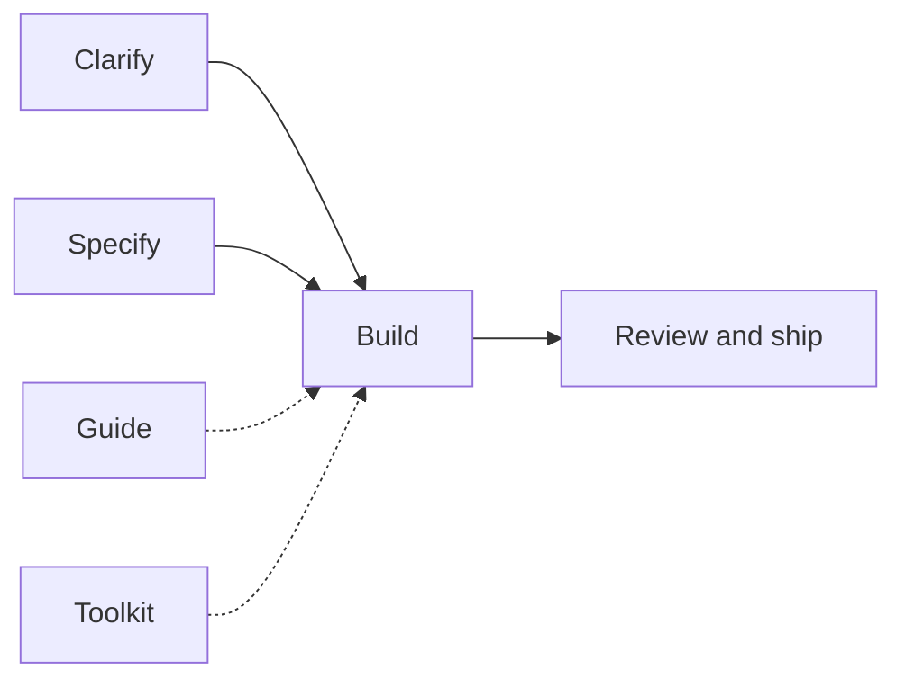

# Gabriel Lafrance Skills

Engineering toolkit for Claude, Cursor, and other harnesses: agent skills, an always-on [`AGENTS.md`](./AGENTS.md) contract, an optional Cursor plugin, and ESLint/Prettier templates.

## Install

The always-on contract is [`AGENTS.md`](./AGENTS.md). `/setup-toolkit` copies that file into the app root and into the user-level instruction path for Claude and Cursor. Do not add a parallel `CLAUDE.md`.

**Cursor plugin (optional).** Install **gabriel-skills** from **Customize → Marketplace** (public listing or your team marketplace) when you also want Cursor rules, agents, and commands. Those rules are short pointers at `AGENTS.md`.

Team admins can also import this repo from **Cursor Dashboard → Plugins → Add Marketplace → Import from Repo** using `https://github.com/Gabriel-Lafrance/Skills`.

```bash
# Claude, Cursor, or both. Use one -a flag when you only need one harness.
npx skills@latest add Gabriel-Lafrance/Skills -a claude -a cursor -s '*' -g -y
npx skills@latest update -g -y
```

`npx skills` copies skill folders. It does not copy `AGENTS.md`, `rules/`, `agents/`, or `commands/`. Run `/setup-toolkit` in an app to install the contract.

Installed skills **must follow** [`/taste`](./skills/taste/SKILL.md) and [`/architecture`](./skills/architecture/SKILL.md) on every run ([`pack-shared/standards.md`](./skills/pack-shared/standards.md)). Agents talk to you in ordinary words ([`pack-shared/plain-language.md`](./skills/pack-shared/plain-language.md)). Chat replies follow the Unslop section of [`AGENTS.md`](./AGENTS.md). `/ask-gabriel` stays a thin router and does not load `/taste` or `/architecture`.

If you previously pasted gold standards into a harness text box, remove that paste. `AGENTS.md` is the one copy.

The end-to-end build orchestrator is [`/task`](./skills/task/SKILL.md). This pack used `/goal` for that job; Cursor now owns `/goal`, so use `/task` instead.

## What ships

The contract and the skills work in any harness. The Cursor plugin is one adapter on top. It does **not** ship MCP servers or hooks yet (hooks run scripts on every edit; that stays a later, explicit choice).

| Piece | Where | What it does |
| --- | --- | --- |
| **Contract** | `AGENTS.md` | Always-on bars. `/setup-toolkit` copies this file into the app and the user-level path |
| **Skills** | `skills/` | Workflows you invoke (`/task`, `/grill-me`, `/setup-toolkit`, …) |
| **Rules** | `rules/*.mdc` | Cursor pointers at headings in `AGENTS.md`. `gold-standards.mdc` is the one Read. The others stay toggleable and do not repeat the prose |
| **Agents** | `agents/` | Cursor specialist configs: explorer, analyzer, implementer, designer, reviewer, pr-reviewer, tester |
| **Commands** | `commands/` | `/setup-toolkit` slash command (same job as the skill) |
| **ESLint / Prettier / editor / quality gate** | `skills/setup-toolkit/templates/` | Config copied **into your app** by `/setup-toolkit`, including no-emdash, `test:quality` (cyclomatic complexity (McCabe) cap 5 plus principle and dead-code gates), `test:mutants` (Stryker), and `.vscode` extension recommendations |

ESLint, Prettier, and `test:quality` are app-repo config, not harness primitives. They only run if the app repo has config and packages. `/setup-toolkit` writes those files next to your `package.json`, plus `.vscode/extensions.json` (ESLint + Prettier extensions) and `.vscode/settings.json` (format on save). Cursor reads the `.vscode` folder the same way VS Code does.

### Plugin rules (pointers at AGENTS.md)

| Rule | When it applies |
| --- | --- |
| [`gold-standards.mdc`](./rules/gold-standards.mdc) | Always: Read `AGENTS.md` (Gold standards, including grill before a plan) |
| [`no-emdash.mdc`](./rules/no-emdash.mdc) | Always: obey **No em dash** in `AGENTS.md` |
| [`unslop.mdc`](./rules/unslop.mdc) | Always: obey **Unslop** in `AGENTS.md` |
| [`subagents.mdc`](./rules/subagents.mdc) | Always: obey **Subagents** in `AGENTS.md` |
| [`ship-work.mdc`](./rules/ship-work.mdc) | Obey **Ship work** in `AGENTS.md` |
| [`project-tooling.mdc`](./rules/project-tooling.mdc) | Obey **Project tooling** in `AGENTS.md` |

Toggle individual rules in **Customize → Rules** (Always / Agent Decides / Manual). Taste and architecture stay in skills. Do not paste `AGENTS.md` into a User Rules box or into these `.mdc` files.

`/setup-toolkit` copies `AGENTS.md` by default. Copy `rules/*.mdc` into an app's `.cursor/rules/gabriel-skills/` only when you ask for that pin.

### Plugin agents

Named roles for the Cursor adapter. Other harnesses use the same roles through their specialist tool, or as a separate pass when they cannot spawn one. The roles do not replace the skills; they load the same doctrines. The parent feeds **what** to do and **need-to-know**; each specialist owns **how**. Pick the listed specialist that owns the job. Do not follow a fixed spawn order. Explorer finds. Analyzer judges. Designer owns user-facing UI. Tester always writes tests. A harness built-in that matches the job is fine.

| Agent | Owns | Skill |
| --- | --- | --- |
| [`explorer`](./agents/explorer.md) | Find relevant paths and snippets | noisy search (not `/analyze`) |
| [`analyzer`](./agents/analyzer.md) | How / impact / risk memo | `/analyze` |
| [`implementer`](./agents/implementer.md) | One tiny non-UI code what | `/implement` |
| [`designer`](./agents/designer.md) | User-facing UI and `docs/design.md` | `/design` |
| [`reviewer`](./agents/reviewer.md) | Local branch diff vs the what | `/code-review` |
| [`pr-reviewer`](./agents/pr-reviewer.md) | Open GitHub PR comments | `/pr-review` |
| [`tester`](./agents/tester.md) | Write tests (always summoned) | `/create-test` (user start only) |

## Skills

Five kinds. **Guide** informs; everything else moves work forward.

| Job               | Skills                                                   | Purpose               |
| ----------------- | -------------------------------------------------------- | --------------------- |
| **Guide**         | `/ask-gabriel`, `/taste`, `/architecture`                | Route and standards   |
| **Clarify**       | `/grill-me`, `/analyze`                                  | Intent and research   |
| **Specify**       | `/write-ticket`                                          | One prompt → detailed ticket |
| **Build**         | `/task`, `/just-do-it`, `/design`                        | Implement end-to-end; UI worker |
| **Review & ship** | `/code-review`, `/publish`, `/pr-review`, `/create-test` | Quality gates and PRs |
| **Toolkit**       | `/setup-toolkit`                                         | Copy `AGENTS.md`, then ESLint, Prettier, editor extensions, `test:quality` / `test:mutants`, and `docs/design.md` init in the current app |



**Unsure which to run?** Start with [`/ask-gabriel`](./skills/ask-gabriel/SKILL.md).

## Common paths

- Think / research → `/analyze`
- Fuzzy intent → `/grill-me`
- Ticket from a note → `/write-ticket` (analyzes; asks only if too short)
- Ticket → build → `/write-ticket` then `/task`
- Build now → `/task` or `/just-do-it`
- Capture app UX / build a screen → `/design` (also used inside `/task` for frontend)
- Lint/format/quality gates in this app → `/setup-toolkit`
- Ship a PR → `/publish` (or `/just-do-it` / a cloud agent). Every path that
  opens a GitHub PR follows the same ship contract: typed body and Change
  diagram.
- Review a PR → `/pr-review`

Skill details live under [`skills/`](./skills/). Pack maintenance: [how-to.md](./how-to.md).

## License

MIT — see [LICENSE](./LICENSE).

## Community

- [Contributing](.github/CONTRIBUTING.md)
- [Code of Conduct](.github/CODE_OF_CONDUCT.md)
- [Security policy](.github/SECURITY.md)

Inspired by [Matt Pocock](https://github.com/mattpocock/skills).
