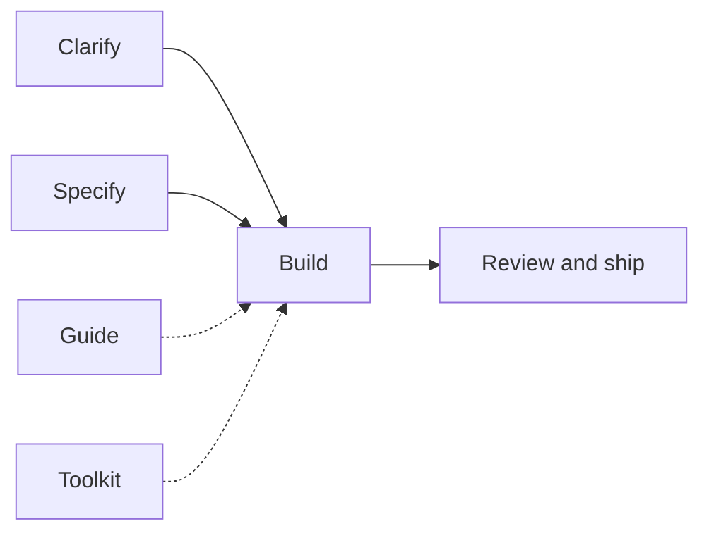

# Gabriel Lafrance Skills

Engineering toolkit for Cursor: agent skills, plugin rules, custom agents, commands, and ESLint/Prettier templates.

## Install

**Cursor plugin (recommended).** Install **gabriel-skills** from **Customize → Marketplace** (public listing or your team marketplace). That is the full toolkit: skills, rules, agents, and commands.

Team admins can also import this repo from **Cursor Dashboard → Plugins → Add Marketplace → Import from Repo** using `https://github.com/Gabriel-Lafrance/Skills`.

```bash
# Skills only (no plugin rules, agents, or commands)
npx skills@latest add Gabriel-Lafrance/Skills -a cursor -s '*' -g -y
npx skills@latest update -g -y
```

Installed skills **must follow** [`/taste`](./skills/taste/SKILL.md) and [`/architecture`](./skills/architecture/SKILL.md) on every run ([`pack-shared/standards.md`](./skills/pack-shared/standards.md)). Agents talk to you in ordinary words ([`pack-shared/plain-language.md`](./skills/pack-shared/plain-language.md)). Chat replies follow the unslop plugin rule ([`unslop.mdc`](./rules/unslop.mdc)). `/ask-gabriel` stays a thin router and does not load `/taste` or `/architecture`.

If you previously pasted gold standards into **User Rules**, remove that paste after installing the plugin so the same text is not applied twice.

The end-to-end build orchestrator is [`/task`](./skills/task/SKILL.md). This pack used `/goal` for that job; Cursor now owns `/goal`, so use `/task` instead.

## What the plugin ships

Cursor plugins can bundle more than skills. This one uses the pieces that help engineers day to day. It does **not** ship MCP servers or hooks yet (hooks run scripts on every edit; that stays a later, explicit choice).

| Piece | Where | What it does |
| --- | --- | --- |
| **Skills** | `skills/` | Workflows you invoke (`/task`, `/grill-me`, `/setup-toolkit`, …) |
| **Rules** | `rules/*.mdc` | Persistent Cursor rules. `gold-standards.mdc`, `no-emdash.mdc`, and `unslop.mdc` always apply; the others attach when relevant |
| **Agents** | `agents/` | Task roles: explorer, architect, implementer, reviewer, pr-reviewer |
| **Commands** | `commands/` | `/setup-toolkit` slash command (same job as the skill) |
| **ESLint / Prettier / editor / quality gate** | `skills/setup-toolkit/templates/` | Config copied **into your app** by `/setup-toolkit`, including no-emdash, a cyclomatic complexity test (max 5), and `.vscode` extension recommendations |

ESLint, Prettier, and the cyclomatic quality gate are **not** Cursor plugin primitives. They only run if the app repo has config and packages. `/setup-toolkit` writes those files next to your `package.json`, plus `.vscode/extensions.json` (ESLint + Prettier extensions) and `.vscode/settings.json` (format on save). Cursor reads the `.vscode` folder the same way VS Code does.

### Plugin rules (not User Rules)

| Rule | When it applies |
| --- | --- |
| [`gold-standards.mdc`](./rules/gold-standards.mdc) | Always: force doctrine Reads, grill before a plan, Before/After diagrams |
| [`no-emdash.mdc`](./rules/no-emdash.mdc) | Always: never write em dash, en dash, or horizontal bar |
| [`unslop.mdc`](./rules/unslop.mdc) | Always: cut AI tells from the assistant's reply in this discussion |
| [`ship-work.mdc`](./rules/ship-work.mdc) | PRs, branches, shipping |
| [`subagents.mdc`](./rules/subagents.mdc) | Multi-file research, implement, review |
| [`project-tooling.mdc`](./rules/project-tooling.mdc) | ESLint / Prettier already in the repo, or installing them |

Toggle individual rules in **Customize → Rules** (Always / Agent Decides / Manual). Taste and architecture stay in skills. `no-emdash.mdc` and `unslop.mdc` are self-contained writing bars.

To pin the same `.mdc` files in an **app** repo (cloud agents, teammates without the plugin), ask `/setup-toolkit` to copy them into `.cursor/rules/gabriel-skills/`.

### Plugin agents

Named roles for Task / custom agents. They do not replace the skills; they load the same doctrines.

| Agent | Owns | Skill |
| --- | --- | --- |
| [`explorer`](./agents/explorer.md) | Read-only research memo | `/analyze` |
| [`architect`](./agents/architect.md) | Structure card | `/architecture` |
| [`implementer`](./agents/implementer.md) | One bounded code slice | `/implement` |
| [`reviewer`](./agents/reviewer.md) | Local branch diff | `/code-review` |
| [`pr-reviewer`](./agents/pr-reviewer.md) | Open GitHub PR comments | `/pr-review` |

## Skills

Five kinds. **Guide** informs; everything else moves work forward.

| Job               | Skills                                                   | Purpose               |
| ----------------- | -------------------------------------------------------- | --------------------- |
| **Guide**         | `/ask-gabriel`, `/taste`, `/architecture`                | Route and standards   |
| **Clarify**       | `/grill-me`, `/analyze`                                  | Intent and research   |
| **Specify**       | `/write-ticket`                                          | One prompt → detailed ticket |
| **Build**         | `/task`, `/just-do-it`                                   | Implement end-to-end  |
| **Review & ship** | `/code-review`, `/publish`, `/pr-review`, `/create-test` | Quality gates and PRs |
| **Toolkit**       | `/setup-toolkit`                                         | ESLint, Prettier, editor extensions, and a cyclomatic quality-gate test in the current app |



**Unsure which to run?** Start with [`/ask-gabriel`](./skills/ask-gabriel/SKILL.md).

## Common paths

- Think / research → `/analyze`
- Fuzzy intent → `/grill-me`
- Ticket from a note → `/write-ticket` (analyzes; asks only if too short)
- Ticket → build → `/write-ticket` then `/task`
- Build now → `/task` or `/just-do-it`
- Lint/format/complexity gate in this app → `/setup-toolkit`
- Ship a PR → `/publish` (or `/just-do-it` / a cloud agent). Every path that
  opens a GitHub PR follows the same ship contract: typed body, Change
  diagram, Browser screenshots when visual (not a UI test pass), and a Cursor
  review canvas.
- Review a PR → `/pr-review`

Skill details live under [`skills/`](./skills/). Pack maintenance: [how-to.md](./how-to.md).

## License

MIT — see [LICENSE](./LICENSE).

## Community

- [Contributing](.github/CONTRIBUTING.md)
- [Code of Conduct](.github/CODE_OF_CONDUCT.md)
- [Security policy](.github/SECURITY.md)

Inspired by [Matt Pocock](https://github.com/mattpocock/skills).
