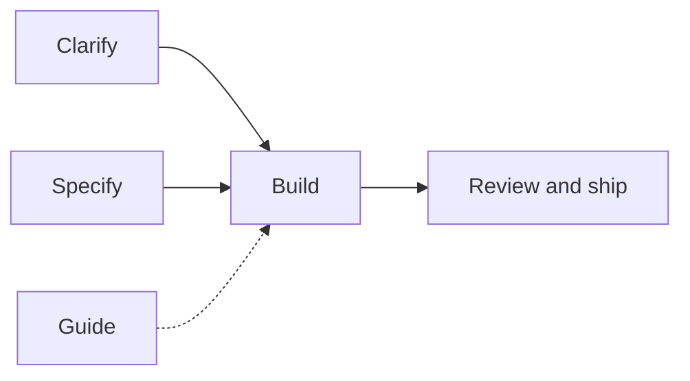

# Gabriel Lafrance Skills

Cursor agent skills for real engineering work.

## Install

```bash
# Global (recommended)
npx skills@latest add Gabriel-Lafrance/Skills -a cursor -s '*' -g -y
npx skills@latest update -g -y

# Or project-only
npx skills@latest add Gabriel-Lafrance/Skills -a cursor -s '*' -y
```

Installed skills **must follow** [`/taste`](./skills/taste/SKILL.md) and [`/architecture`](./skills/architecture/SKILL.md) on every run ([`pack-shared/standards.md`](./skills/pack-shared/standards.md)). Agents talk to you in ordinary words ([`pack-shared/plain-language.md`](./skills/pack-shared/plain-language.md)) — no unexplained jargon. `/ask-gabriel` stays a thin router and does not load those bodies.

Optional, for Plan mode and freeform chats that never invoke a skill: paste [`rules/ultimate-gold-standards.mdc`](./rules/ultimate-gold-standards.mdc) (body only, no YAML frontmatter) into **Cursor Settings → Rules → User Rules**. Keep that file in `rules/` — it is opt-in, not installed by `npx skills`.

## What this pack is

Five kinds of skills. **Guide** informs; everything else moves work forward.

| Job               | Skills                                                   | Purpose               |
| ----------------- | -------------------------------------------------------- | --------------------- |
| **Guide**         | `/ask-gabriel`, `/taste`, `/architecture`                | Route and standards   |
| **Clarify**       | `/grill-me`, `/analyze`                                  | Intent and research   |
| **Specify**       | `/write-ticket`                                          | Tracker tickets       |
| **Build**         | `/goal`, `/just-do-it`                                   | Implement end-to-end  |
| **Review & ship** | `/code-review`, `/publish`, `/pr-review`, `/create-test` | Quality gates and PRs |



**Unsure which to run?** Start with [`/ask-gabriel`](./skills/ask-gabriel/SKILL.md).

## Common paths

- Think / research → `/analyze`
- Fuzzy intent → `/grill-me`
- Ticket → build → `/write-ticket` then `/goal`
- Build now → `/goal` or `/just-do-it`
- Ship a PR → `/publish` (or `/just-do-it` / a cloud agent). Every path that
  opens a GitHub PR follows the same ship contract: typed body, Change
  diagram, demo screenshots/video when visual, and a Cursor review canvas.
- Review a PR → `/pr-review`

Skill details live under [`skills/`](./skills/). Pack maintenance: [how-to.md](./how-to.md).

## License

MIT — see [LICENSE](./LICENSE).

## Community

- [Contributing](.github/CONTRIBUTING.md)
- [Code of Conduct](.github/CODE_OF_CONDUCT.md)
- [Security policy](.github/SECURITY.md)

Inspired by [Matt Pocock](https://github.com/mattpocock/skills).
