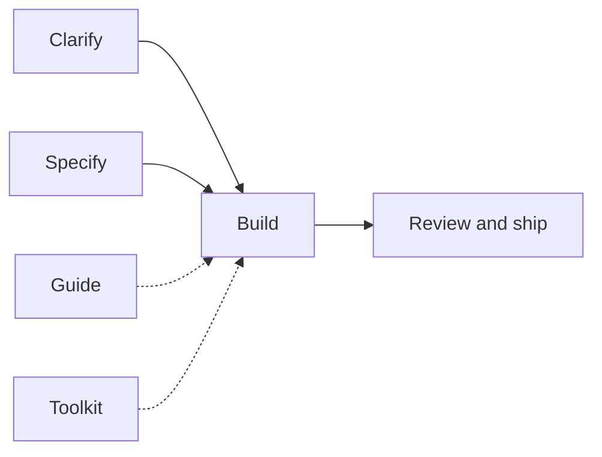

# Gabriel Lafrance Skills

Engineering toolkit for any harness: agent skills and an always-on [`AGENTS.md`](./AGENTS.md) contract. Claude, Cursor, and Codex each install it as one plugin. Ono's skill browser reads each skill's description and category.

## Install

Pick one surface. They all read this repo. They do not all copy the same files.

### skills.sh

This pack is on [skills.sh](https://skills.sh/gabriel-lafrance/skills/setup-gabriel-skills). Install **one** skill, then run it. That installs the rest of the skills, including `rules/`, and places `AGENTS.md` where the harness reads it. It does not install ESLint or Prettier.

```bash
npx skills@latest add gabriel-lafrance/skills@setup-gabriel-skills -g -y
```

In an app chat, run `/setup-gabriel-skills`. Do not add a project `CLAUDE.md`.

`npx skills find setup-gabriel-skills` ranks by install count. Use the command above, not the leaderboard.

To copy every skill without running setup:

```bash
npx skills@latest add gabriel-lafrance/skills --all -g
npx skills@latest update -g -y
```

`--all` is every skill, every harness the CLI already sees. Use `-a claude` or `-a cursor` alone when you only want one.

`npx skills` copies skill folders. It does not copy root `AGENTS.md`. `/setup-gabriel-skills` installs the other skills and places that file from the pack root or from GitHub. If it cannot, it offers a manual copy.

### Ono skill browser

Ono's **Add a skill** dialog lists each skill as its own card. The card text is the one-line `description` in that skill's `SKILL.md`. The chip is the `category` field: Code, Data, Design, Documents, General, or Web. A folded description (`description: >-`) shows up as `>-`, so descriptions in this pack stay on one line.

### Claude marketplace

Claude Code reads [`.claude-plugin/marketplace.json`](./.claude-plugin/marketplace.json). That plugin entry is category `productivity`, with tags for search. Add this repo, then install the one plugin:

```text
/plugin marketplace add Gabriel-Lafrance/Skills
/plugin install gabriel-skills@gabriel-skills
```

### Codex marketplace

Codex and ChatGPT read [`.agents/plugins/marketplace.json`](./.agents/plugins/marketplace.json). That file is not a copy of the Claude listing. It names the same plugin, category Productivity, and points `source.path` at this repo. Add the marketplace, then add the plugin:

```text
codex plugin marketplace add Gabriel-Lafrance/Skills
codex plugin add gabriel-skills@gabriel-skills
```

### Cursor plugin

Install **gabriel-skills** from **Customize → Marketplace** (public listing or your team marketplace). Team admins can import this repo from **Cursor Dashboard → Plugins → Add Marketplace → Import from Repo** using `https://github.com/Gabriel-Lafrance/Skills`. The Cursor manifests are in [`.cursor-plugin/`](./.cursor-plugin/), with the same category and tags as the Claude listing. Cursor follows [`AGENTS.md`](./AGENTS.md). There is no Cursor rules copy.

The skills.sh repo page still lists retired names (`goal`, `orchestrate`, `create-plan`, `setup-toolkit`) from older installs. Those folders are gone. `/goal` is [`/task`](./skills/task/SKILL.md). `/setup-toolkit` is [`/setup-gabriel-skills`](./skills/setup-gabriel-skills/SKILL.md). `/code-review` and `/pr-review` were merged into [`/review`](./skills/review/SKILL.md). `/taste` and `/architecture` were removed: their examples live in [`skills/rules/`](./skills/rules/SKILL.md). `/trackers` and `/design` were removed: `/task` reads a ticket or PR directly, and the UI and UX rules live in [`user-experience.md`](./skills/rules/user-experience.md). `/create-test` was removed: how tests are written lives in [`testing.md`](./skills/rules/testing.md). The old `pack-shared` folder was folded into [`skills/rules/`](./skills/rules/SKILL.md) (asking and plain language in `writing-style.md`, execution context in `planning.md`, ship steps in `shipping.md`); the review contract moved into `/review`.

[`AGENTS.md`](./AGENTS.md) is the always-on index. The rules it points to live in [`skills/rules/`](./skills/rules/SKILL.md); [`code-quality.md`](./skills/rules/code-quality.md) and [`code-structure.md`](./skills/rules/code-structure.md) always apply, with good and bad snippets in [`code-quality-examples.md`](./skills/rules/code-quality-examples.md) and [`code-structure-examples.md`](./skills/rules/code-structure-examples.md). Agents talk to you in ordinary words, and chat replies follow [`writing-style.md`](./skills/rules/writing-style.md). `/ask-gabriel` stays a thin router and does not restate those rules.

If you previously pasted gold standards into a harness text box, remove that paste. `AGENTS.md` is the one copy.

The end-to-end build orchestrator is [`/task`](./skills/task/SKILL.md). This pack used `/goal` for that job; Cursor now owns `/goal`, so use `/task` instead.

## What ships

The contract and the skills work in any harness. There is no Cursor-only ruleset. The Claude, Cursor, and Codex plugins ship the same skills. They do **not** ship MCP servers or hooks yet (hooks run scripts on every edit; that stays a later, explicit choice).

| Piece | Where | What it does |
| --- | --- | --- |
| **Contract** | `AGENTS.md` | Always-on index for every harness, including Cursor. It points to the rule files in `skills/rules/`. `/setup-gabriel-skills` places this file where the harness reads it |
| **Skills** | `skills/` | Workflows you invoke (`/task`, `/grill-me`, `/setup-gabriel-skills`, …). Each `SKILL.md` has a one-line `description` and one `category` for the Ono skill card |
| **Claude marketplace** | `.claude-plugin/` | Plugin listing Claude Code installs. Copilot reads this file too. Category `productivity`, plus search tags |
| **Codex marketplace** | `.agents/plugins/marketplace.json` | Codex and ChatGPT listing. Category Productivity, with an install policy. Not a copy of the Claude file |
| **Cursor marketplace** | `.cursor-plugin/` | Same plugin listing as Claude, for Cursor |
| **Setup command** | `commands/setup-gabriel-skills.md` | Slash entry for the same `/setup-gabriel-skills` skill |

## Skills

Six kinds. **Guide** informs; everything else moves work forward. Card categories: `/task`, `/task-with-tests`, and `/review` are Code. `/analyze` and `/write-ticket` are Documents. `/ask-gabriel`, `/grill-me`, and `/setup-gabriel-skills` are General.

| Job               | Skills                                                   | Purpose               |
| ----------------- | -------------------------------------------------------- | --------------------- |
| **Guide**         | `/ask-gabriel`                                           | Route to the next skill |
| **Clarify**       | `/grill-me`, `/analyze`                                  | Intent and research   |
| **Specify**       | `/write-ticket`                                          | Memo, Research, or Plan |
| **Build**         | `/task-with-tests`, `/task`                              | Implement end-to-end. `/task-with-tests` is the default and writes the accepted tests before the code; `/task` skips tests |
| **Review & ship** | `/review`, `/verification`, `/test-audit`                | Review the code, prove the work runs, and prune low-value tests. Test rules are in `skills/rules/testing.md`; branch and PR rules are in `skills/rules/shipping.md` |
| **Toolkit**       | `/setup-gabriel-skills`                                  | Install this pack's skills and place `AGENTS.md`. Manual copy only if that install fails |


```mermaid
flowchart LR
  clarify[Clarify] --> build[Build]
  specify[Specify] --> build
  guide[Guide] -.-> build
  toolkit[Toolkit] -.-> build
  build --> ship[Review and ship]
```

**Unsure which to run?** Start with [`/ask-gabriel`](./skills/ask-gabriel/SKILL.md).

## Common paths

- Think / research → `/analyze`
- Fuzzy intent → `/grill-me`
- Idea to keep → `/write-ticket` Memo
- Understand a problem → `/write-ticket` Research (grills before it saves)
- One-shot build spec → `/write-ticket` Plan, then `/task-with-tests`
- Build now → `/task-with-tests` (the default build; refuse every test and it continues as `/task`)
- Build with no tests at all → `/task`
- Build a screen → `/task-with-tests` (applies [`user-experience.md`](./skills/rules/user-experience.md) and `docs/design.md`)
- This pack on a new machine → `/setup-gabriel-skills`
- Ship a PR → [`skills/rules/shipping.md`](./skills/rules/shipping.md) (any agent, including a cloud agent). Every path that
  opens a GitHub PR follows the same ship contract: typed body and Change
  diagram.
- Review a branch or a PR → `/review`
- Prove a change works in the running app (UI flow, migration, endpoint, job) → `/verification`
- Prune low-value or duplicate tests → `/test-audit`

Skill details live under [`skills/`](./skills/). Pack maintenance: [how-to.md](./how-to.md).

## License

MIT. See [LICENSE](./LICENSE).

## Community

- [Contributing](.github/CONTRIBUTING.md)
- [Code of Conduct](.github/CODE_OF_CONDUCT.md)
- [Security policy](.github/SECURITY.md)

Inspired by [Matt Pocock](https://github.com/mattpocock/skills).
