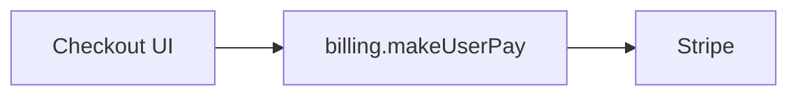
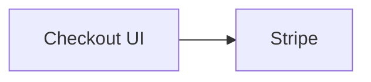

# Analyze doctrine

Turn an ask into an evidence-backed analysis memo in chat. `/analyze` is
**dual** — load exactly one of `standalone.md` or `flow.md` via
[variants.md](../pack-shared/variants.md). It does not implement, create
tickets, or create automatic runtime artifacts.

**Execution context:** [../pack-shared/execution-context.md](../pack-shared/execution-context.md) · **Ask style:** [../pack-shared/asking.md](../pack-shared/asking.md)

## Inputs

| Input | Use |
| --- | --- |
| Rough idea, title, or notes | Normalize the problem and investigate it |
| Ticket or PR | Read its current body, comments, and relevant diff as evidence |
| Existing in-chat memo | Refresh only the evidence or open questions that need it |
| `/write-ticket` seed | Flow: full standard memo even if the seed is ungrilled or a “don’t forget this” note; return to that parent. Do not stub. |
| `/just-do-it` parent brief | Flow: research then return (parent may instruct promote + start) |
| Named review Fix-now rows | Flow: review-remediation mode only for those rows |

Facts come from live repository, ticket, PR, and diff evidence. User decisions,
waivers, invariants, and promotions come only from the visible execution
context or a new user answer.

## Research

1. Refresh the applicable execution context: ask, outcome, non-goals, lane,
   ticket/PR, fixed point, and any settled rules.
2. Rediscover the relevant code and sibling patterns. Identify entrypoints,
   constraints, likely touch surface, existing tests, and the smallest coherent
   interface or service boundary.
3. Non-trivial research **must** use Task workers per
   [../pack-shared/subagents.md](../pack-shared/subagents.md). When ≥2
   independent research lanes exist, **must** spawn parallel `explore` Tasks
   before synthesizing the memo. Give each the applicable execution context
   and wait for all results; never sleep or poll for them. Trivial single-path
   lookups may stay on the main agent.
4. Apply **`/taste` and `/architecture` always** (see
   [standards.md](../pack-shared/standards.md)). Prefer good siblings and
   behavior-preserving moves. Do not skip the architecture Read because the
   ask looks like a single file — apply “keep the existing structure” when
   that is the smallest correct answer.
5. Post the memo below. Ask one batch only for material unknowns that research
   cannot answer (standalone), or return unknowns to the parent (flow).

## Analysis memo

Post this in chat; keep it current in the execution context rather than in an
agent-owned file. Lead with a high-level Mermaid diagram so a reader can see
the path before the prose.

Diagram rules:

- Prefer modules, actors, and request/data flow — not every file or function.
- **New or additive work:** one diagram of the recommended path.
- **Rework** (bug, hotfix, refactor, or a flow that changes): Before and After
  under Diagram, keeping the same node ids where possible.
- **Race, ordering, double-submit, concurrency:** a `sequenceDiagram` of the
  failing interleave, plus the expected order when it is known.
- Use `flowchart`, `sequenceDiagram`, or `graph` — pick the clearest form.
- Name real modules/services/routes from the evidence. Do not invent a shape
  the repo does not support.
- Omit only when the ask is truly diagram-hostile (typo, copy, one-line chore)
  and say why under Diagram.

````markdown
## Analysis memo
**Ask:** <one line>
**Evidence:** <ticket/PR/repository facts and cited paths>

### Diagram



### Current behavior
…

### Likely entrypoints
- `path` — why

### Recommended direction
<smallest coherent approach and why — cite `/taste` principles **and** `/architecture` ownership when they drive the shape>

### Interface / ownership sketch
**Shape:** <hook | class | service/facade | function(s)>
**Owner:** <existing or proposed deep boundary>
**Architecture notes:** <keep jobs apart / related together / safe to retry / trust the server if relevant | none>
**Not prescribed:** implementation details

### Touch surface and constraints
- …

### Risks / unknowns
- …

### Draft /goal seed
**Outcome:** …
**Done when:** <binary checks>
**Non-goals:** …
**Lane:** …
**Active Rules:** <relevant `INV-*` rows or none>
````

For rework, replace the single mermaid with:

````markdown
### Diagram

#### Before



#### After


````

Include the draft `/goal` seed when the work is buildable. It is context for a
possible next phase, not a promotion or implementation authorization.

## Hand-off (standalone only)

For standalone analysis, if the user did not already name the next step, offer
one batch:

```markdown
## Questions
Reply like: 1a

1. Next step for this analysis?
   - a) Done — keep the memo in chat ← recommended when no build is intended
   - b) Sharpen the memo
   - c) Promote the inline seed to `/goal`
   - d) Draft a ticket from this memo with `/write-ticket`
   - e) Promote to `/goal` and begin that flow
```

| Choice | Do |
| --- | --- |
| a) Done | Leave the memo and execution context visible; stop. |
| b) Sharpen | Research only the open point, then revise the memo. |
| c) Promote | Explicitly carry the inline seed and locked decisions into `/goal`. |
| d) Write ticket | Hand the in-chat memo to `/write-ticket`; do not require a saved artifact. |
| e) Promote + start | Carry the inline seed into `/goal`, then continue through its grill or pre-cleared path. |

Flow parents (`/write-ticket`, `/just-do-it`) own the next step — see
[flow.md](flow.md). `/just-do-it` may explicitly instruct the `promote + start`
handoff under its autonomy policy after the memo is shown.

Never promote from an implication, a code change, or a previous artifact.
Optional persistence follows the shared
[destination-approval rule](../pack-shared/execution-context.md#optional-persistence).

## Review remediation analysis

Use this mode only after the user selected named **Fix now** rows from a review,
or a `/just-do-it` parent explicitly forwarded named rows under its autonomy
policy. Always load **flow** for this mode. Do not add findings, reopen product
discovery, or analyze Follow-up items and nits.

1. Refresh the review pass, fixed-point diff, selected rows, cited rules, lane,
   and current goal context in chat.
2. Inspect each selected row against the code.
3. Return one section for every selected stable finding ID before asking for
   promotion:

```markdown
## Review remediation analysis
**Scope:** named Fix-now rows only

### Diagram
<one mermaid of the failing path → smallest fix, or Before/After; omit if a single-line change and say why>

### <finding-id> — <short finding>
**Source:** <review pass + path/symbol>
**Rule:** <`INV-*`, acceptance criterion, or review rule>
**Current behavior and evidence:** …
**Root cause:** …
**Proposed smallest fix:** …
**Why not more machinery:** …
**Touch surface:** <paths, symbols, direct callers>
**Verification:** …
**Non-goals:** …

## Promotion candidate
**Outcome:** …
**Done when:** <one binary row per selected finding ID>
**Lane:** …
**Active Rules:** <preserved and newly locked rules>
```

4. Ask whether to promote selected rows, sharpen a named section, or keep the
   analysis only. Promotion is always explicit, except that `/just-do-it` may
   take the recommended promotion only after this complete memo exists.

```markdown
## Questions
Reply like: 1a

1. What should happen with these proposed remediations?
   - a) Promote selected finding IDs into bounded Fix mode ← recommended
   - b) Sharpen a selected finding before deciding
   - c) Keep the analysis only; do not implement
```

When an explicit `/just-do-it` parent requested this remediation, apply `a)`
after showing the complete memo; do not wait for this Questions batch.

On promotion, carry only the selected finding IDs, their lane, rules, and
verification into the current `/goal` context or a new bounded `/goal` flow.
On the other choices, leave code unchanged.

## Anti-patterns

- Treating a memo as implementation or ticket-write approval
- Stubbing flow analysis because a `/write-ticket` seed is short
- Posting a memo with no diagram when the path can be drawn
- Drawing every file instead of modules, actors, and flow
- Creating hidden state to resume analysis
- Asking the user for repository or tracker facts that can be rediscovered
- Promoting a remediation without first showing its complete stable-finding analysis
- Replacing evidence with an implementation-level design
- Loading both standalone and flow variants in one turn
