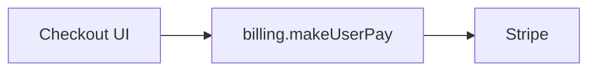

# Analyze doctrine

## Job

Turn an ask into an evidence-backed analysis memo in chat. `/analyze` does not implement, create tickets, or create automatic runtime artifacts. Nested vs one-off hand-off lives in [SKILL.md](SKILL.md).

## Owns

Inputs, research rules, the analysis memo, one-off hand-off Questions, and review-remediation analysis.

## Does not own

- Implementation, ticket writes, or `/task` promotion unless the user (or an explicit parent instruction) chooses it
- Code quality and structure bars: cite `quality:*` and `structure:*`
- Numbered process: [`SKILL.md`](SKILL.md)

## Cite keys

none (uses `quality:*` and `structure:*`)

## Bars

**Execution context:** [planning.md](../rules/planning.md#execution-context) · **Ask style:** [Asking the user](../rules/writing-style.md#asking-the-user)

Facts come from live repository, ticket, PR, and diff evidence. User decisions, waivers, invariants, and promotions come only from the visible execution context or a new user answer.

### Inputs

| Input | Use |
| --- | --- |
| Rough idea, title, or notes | Normalize the problem and investigate it |
| Ticket or PR | Read its current body, comments, and relevant diff as evidence |
| Existing in-chat memo | Refresh only the evidence or open questions that need it |
| `/write-ticket` seed | Nested: full standard memo for Research (the problem) or Plan (the code that would change). Return to that parent. Do not stub. A Memo does not call this skill. |
| Named review Fix-now rows | Nested: review-remediation mode only for those rows |

### Research rules

- Refresh the applicable execution context: ask, outcome, non-goals, lane, ticket/PR, fixed point, and any settled rules.
- Rediscover the relevant code and sibling patterns. Identify entrypoints, constraints, likely touch surface, existing tests, and the smallest coherent interface or service boundary.
- Find facts before judging them. Judge how, impact, risk, and files touched only from paths and snippets you actually read.
- Apply the rules in [code-quality.md](../rules/code-quality.md) and [code-structure.md](../rules/code-structure.md) on every run. Prefer good siblings and behavior-preserving moves. Do not skip [code-structure.md](../rules/code-structure.md) because the ask looks like a single file. Apply “keep the existing structure” when that is the smallest correct answer. Do not invent a parallel layout.

Review-remediation mode: use only after the user selected named **Fix now** rows from a review. Do not add findings, reopen product discovery, or analyze Follow-up items and nits.

## Output

Post the memo in chat; keep it current in the execution context rather than in an agent-owned file. Lead with a high-level Mermaid diagram so a reader can see the path before the prose.

The memo diagram follows the [Change diagram](../rules/shipping-templates.md#change-diagram) section of shipping-templates.md: one diagram for new work, Before/After for rework. Plans use Before/After instead ([planning.md](../rules/planning.md)). On top of that section:

- **Race, ordering, double-submit, concurrency:** a `sequenceDiagram` of the failing interleave, plus the expected order when it is known.
- Name real modules/services/routes from the evidence. Do not invent a shape the repo does not support.
- If you omit it (typo, copy, one-line chore), say why under Diagram.

````markdown
## Analysis memo
**Ask:** <one line>
**Evidence:** <ticket/PR/repository facts and cited paths>

### Diagram



### Current behavior
…

### Likely entrypoints
- `path`: why

### Recommended direction
<smallest coherent approach and why. Cite `quality:*` and `structure:*` keys when they drive the shape>

### Interface / ownership sketch
**Shape:** <hook | class | service/facade | function(s)>
**Owner:** <existing or proposed deep boundary>
**Architecture notes:** <`quality:keep-jobs-apart` / `quality:related-together` / `quality:safe-to-retry` / `quality:trust-the-server` if relevant | none>
**Not prescribed:** implementation details

### Touch surface and constraints
- …

### Risks / unknowns
- …

### Draft /task seed
**Outcome:** …
**Done when:** <binary checks>
**Non-goals:** …
**Lane:** …
**Rules that must stay true:** <relevant Rule N rows or none>
````

Include the draft `/task` seed when the work is buildable. It is context for a possible next phase, not a promotion or implementation authorization.

### Review remediation analysis

Return one section for every selected stable finding ID before asking for promotion:

```markdown
## Review remediation analysis
**Scope:** named Fix-now rows only

### Diagram
<one mermaid of the failing path → smallest fix, or Before/After; omit if a single-line change and say why>

### <finding-id>: <short finding>
**Source:** <review pass + path/symbol>
**Rule:** <Rule N, Done when item, or review rule>
**Current behavior and evidence:** …
**Root cause:** …
**Proposed smallest fix:** …
**Why not more machinery:** …
**Touch surface:** <paths, symbols, direct callers>
**Verification:** …
**Non-goals:** …

## Promotion candidate
**Outcome:** …
**Done when:** <one binary row per selected finding ID>
**Lane:** …
**Rules that must stay true:** <preserved and newly locked rules>
```

## Apply

For one-off analysis, if the user did not already name the next step, offer one batch:

```markdown
## Questions
Reply like: 1a

1. Next step for this analysis?
   - a) Done: keep the memo in chat ← recommended when no build is intended
   - b) Sharpen the memo
   - c) Promote the inline seed to `/task`
   - d) Draft a ticket from this memo with `/write-ticket`
   - e) Promote to `/task` and start building
```

| Choice | Do |
| --- | --- |
| a) Done | Leave the memo and execution context visible; stop. |
| b) Sharpen | Research only the open point, then revise the memo. |
| c) Promote | Explicitly carry the inline seed and locked decisions into `/task`. |
| d) Write ticket | Hand the in-chat memo to `/write-ticket`; do not require a saved artifact. |
| e) Promote + start | Carry the inline seed into `/task`, then continue through its grill or pre-cleared path. |

A `/write-ticket` parent owns the next step. See [SKILL.md](SKILL.md). Return the memo. Do not start the ticket write or the grill from this skill.

Never promote from an implication, a code change, or a previous artifact. Optional persistence follows the shared [destination-approval rule](../rules/planning.md#optional-persistence).

On promotion of remediation, carry only the selected finding IDs, their lane, rules, and verification into the current `/task` context or a new bounded `/task`. On the other choices, leave code unchanged.

One-off hand-off Questions for remediation:

```markdown
## Questions
Reply like: 1a

1. What should happen with these proposed remediations?
   - a) Promote selected finding IDs into bounded Fix mode ← recommended
   - b) Sharpen a selected finding before deciding
   - c) Keep the analysis only; do not implement
```

## Anti-patterns

- Treating a memo as implementation or ticket-write approval
- Stubbing nested analysis because a `/write-ticket` Research or Plan seed is short
- Posting a memo with no diagram when the path can be drawn
- Drawing every file instead of modules, actors, and flow
- Creating hidden state to resume analysis
- Asking the user for repository or tracker facts that can be rediscovered
- Promoting a remediation without first showing its complete stable-finding analysis
- Replacing evidence with an implementation-level design
- Offering one-off hand-off Questions when a parent owns the next step
- Returning a raw search hit list instead of the `/analyze` memo
- Inventing a parallel layout instead of using the locked structure excerpt
