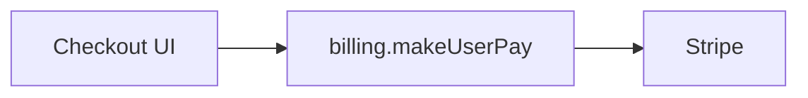

# Analyze doctrine

## Job

Turn an ask into an evidence-backed analysis memo in chat. `/analyze` does not implement, create tickets, or create automatic runtime artifacts. Nested vs one-off hand-off lives in [SKILL.md](SKILL.md).

## Owns

Inputs, research rules, the analysis memo, one-off hand-off Questions, and review-remediation analysis.

## Does not own

- Implementation, ticket writes, or nested promotion and dispatch
- A mechanics walkthrough: [`/how`](../how/SKILL.md)
- Historical rationale with evidence tiers: [`/why`](../why/SKILL.md)
- Code quality and structure bars: cite `quality:*` and `structure:*`
- Numbered process: [`SKILL.md`](SKILL.md)

## Bars

**Execution context:** [planning.md](../rules/planning.md#execution-context) · **Ask style:** [Asking the user](../rules/writing-style.md#asking-the-user)

Facts come from live repository, ticket, PR, and diff evidence. User decisions, waivers, invariants, and promotions come only from the visible execution context or a new user answer.

### Inputs

| Input | Use |
| --- | --- |
| Rough idea, title, or notes | Normalize the problem and investigate it |
| Ticket or PR | Read its current body, comments, and relevant diff as evidence |
| Existing in-chat memo | Refresh only the evidence or open questions that need it |
| `/write-ticket` seed | Nested: investigate the problem and relevant code, then return needed facts, conclusions, source pointers, and uncertainty to the developing ticket in chat. No separate standard memo or saved intermediate artifact is required. |
| Named review Fix-now rows | Nested: review-remediation mode only for those rows |

### Research rules

- Refresh the applicable execution context: ask, outcome, non-goals, area, ticket/PR, fixed point, and any settled rules.
- Rediscover the relevant code, and which parts match a pack example and which are debt. Identify entrypoints, constraints, likely touch surface, existing tests, and the smallest coherent interface or service boundary.
- Find facts before judging them. Judge how, impact, risk, and files touched only from paths and snippets you actually read.
- Trace the affected flow far enough to explain the proposed change: inputs and their meaning, transformations or state transitions, writes, readers, and side effects as relevant. Read actual schemas, public contracts, and callers when they constrain behavior. Follow a dependency only when it could change the recommendation; this is not a full-system audit or a mandatory migration checklist.
- Compare the intended outcome with that flow. Identify choices whose alternatives change behavior, contracts, data meaning or integrity, authority, compatibility, transition safety, scope, or cost. Alternatives can touch exactly the same files and still require a consequential decision. A list of affected files alone does not establish the design.
- Separate researched facts with source pointers, settled user or parent decisions, ordinary implementer choices within those constraints, and unresolved consequential tradeoffs. Resolve factual gaps independently and reuse settled decisions. Choose ordinary details without an interview. For each unresolved consequential choice, explain the evidence or uncertainty, realistic alternatives, recommendation and reason, and practical consequences; return only user-owned choices to the grill.
- Synthesize the proposed design here: connect each material choice to the affected flow, its reason, and the invariants or uncertainty that constrain it. `/how` supplies existing mechanics and `/why` supplies evidenced history; neither owns the new design. Preserve useful exclusions when they prevent a credible implementation mistake, without inventing a rival or interviewing obvious boundaries.
- Apply the rules in [code-quality.md](../rules/code-quality.md) and [code-structure.md](../rules/code-structure.md) on every run. Prefer the pack's examples over the app's existing shapes, and behavior-preserving moves over copying debt.
- Read [code-structure.md](../rules/code-structure.md) even when the ask looks like a single file.
- Apply “keep the existing structure” when that is the smallest correct answer, and stay in that layout instead of inventing a parallel one.

### Public boundary investigation

Use this on the requested flow when a meaningful feature or boundary change,
or observed architecture friction, could affect the design. A copy edit or
simple ticket that keeps the existing contract needs no extra investigation.
Apply [deep public surface](../rules/code-structure.md#deep-public-surface),
[strong foundation](../rules/strong-foundation.md), and
[testing](../rules/testing.md); this is their preparation step, not a new
architecture doctrine or a repository-wide audit.

Read the relevant architecture decisions and domain language when present.
Trace representative callers and their current tests. Look for ordering the
caller must coordinate, repeated policy, pass-through abstractions, or tests
that reach into private details. Name the observed burden and its sources;
a new service file or an extra layer does not prove a deeper boundary.

Recommend retaining the current shape, a small justified behavior-preserving
prefactor, or a material boundary change. Show the proposed owner/public entry,
inputs, outcomes, error behavior, observable ordering and invariants; which
responsibilities and dependencies it hides; and a representative caller before
and after. Explain what callers stop needing to know and where a later change
would land. Preserve settled architecture decisions; surface a conflict only
when concrete evidence makes revisiting it consequential. Leave private
implementation choices open within the contract.

Couple that proposal to its observable verification seam. Identify dependencies
that need real integration evidence versus existing local stand-ins or mocks
at true external boundaries, and the failure modes those substitutes cannot
prove. Use the repository's available strategy, without inventing a test-only
public API. A confirmed future variation follows the foundation rule with one
real implementation; do not manufacture a second adapter. Proposed test work
still needs [consent](../rules/no-unrequested-tests.md), and old tests stay
unless the [retention bar](../rules/testing.md#retention-bar) justifies a change.

Only when a material boundary remains uncertain, reuse the bounded scouts below
to compare a small set of genuinely different interfaces. Give each the same
outcome, constraints, domain terms, caller evidence and dependency facts, plus
one distinct design question. Request a usage sketch, hidden responsibilities,
verification approach and tradeoffs, not implementation or a preferred verdict.
The parent compares caller burden, change locality and verification, recommends
one, and returns only consequential user-owned decisions to the grill. Do not
launch designers for an already settled interface or a routine private detail.

Return the evidence and recommendation into the same developing ticket before
decomposition, using its existing Structure, Foundation and Work items.
Standalone analysis uses the existing memo. No additional report or saved
artifact is required. Adapted from Matt Pocock's pinned
[codebase design](https://github.com/mattpocock/skills/blob/d81f3a183412e71a5b1e84ca21bc1a35eea03a60/skills/engineering/codebase-design/SKILL.md),
[deepening](https://github.com/mattpocock/skills/blob/d81f3a183412e71a5b1e84ca21bc1a35eea03a60/skills/engineering/codebase-design/DEEPENING.md),
[interface alternatives](https://github.com/mattpocock/skills/blob/d81f3a183412e71a5b1e84ca21bc1a35eea03a60/skills/engineering/codebase-design/DESIGN-IT-TWICE.md), and
[architecture investigation](https://github.com/mattpocock/skills/blob/d81f3a183412e71a5b1e84ca21bc1a35eea03a60/skills/engineering/improve-codebase-architecture/SKILL.md).
The pack's canonical rules and authorization gates govern this adaptation.

### Bounded research scouts

Delegate when independently uncertain data or API boundaries would otherwise
require large unrelated reads. A small cohesive path stays one narrow pass.
Give each read-only scout the locked outcome and invariants, one question and
boundary owner, existing evidence and source pointers, and a stopping condition
(the named uncertainty resolved or the missing source identified). Scouts do
not question the user, edit, or start another skill lifecycle.

Return only relevant schemas/contracts, callers, readers/writers, transitions,
constraints, and cited paths or symbols that answer the question. Separate
observed facts from inferences and missing evidence. Stop at the boundary unless
a dependency could change the answer. Reuse an existing `/how` explorer or its
current results for mechanics rather than launching a duplicate investigation.
Use `/why` only for a named historical question that affects the recommendation.
The parent reconciles conflicting evidence, synthesizes the proposed design,
and sends only consequential user choices to `/grill-me`. If delegation is
unavailable, perform the same bounded reads serially and report that limitation.

Review-remediation mode: accept named **Fix now** rows from the active
orchestrator under [remediation](../rules/execution.md#remediation). Analyze
only those rows: add no findings, product discovery, follow-ups, or nits.

## Output

For any parent, follow [nested capabilities](../rules/planning.md#nested-capabilities). Return the researched context directly; no standard memo template is required. Remediation returns the relevant per-finding analysis below, without its own promotion menu. The full memo below is for standalone analysis.

Post the memo in chat; keep it current in the execution context rather than in an agent-owned file. Lead with a high-level Mermaid diagram so a reader can see the path before the prose.

The memo diagram follows the [Change diagram](../rules/shipping-templates.md#change-diagram) section of shipping-templates.md: one diagram for new work, Before/After for rework. Plans use Before/After instead ([planning.md](../rules/planning.md)). On top of that section:

- **Race, ordering, double-submit, concurrency:** a `sequenceDiagram` of the failing interleave, plus the expected order when it is known.
- Name real modules/services/routes from the evidence, and only shapes the repo supports.
- If you omit it (typo, copy, one-line chore), say why under Diagram.

````markdown
## Analysis memo
**Ask:** <one line>
**Evidence:** <ticket/PR/repository facts and cited paths>

### Diagram


```mermaid
flowchart LR
  UI[Checkout UI] --> Billing[billing.makeUserPay]
  Billing --> Stripe[Stripe]
```

### Current behavior
…

### Likely entrypoints
- `path`: why

### Recommended direction
<smallest coherent approach and why. Cite `quality:*` and `structure:*` keys when they drive the shape>

### Interface / ownership sketch
**Shape:** <hook | class | service/facade | function(s)>
**Owner:** <existing or proposed deep boundary>
**Architecture notes:** <`quality:keep-jobs-apart` / `quality:related-together` / `quality:safe-to-retry` / `quality:trust-the-server` if relevant | none>
**Not prescribed:** implementation details

### Touch surface and constraints
- …

### Risks / unknowns
- …

### Draft execution seed
**Outcome:** …
**Done when:** <binary checks>
**Non-goals:** …
**Lane:** …
**Rules that must stay true:** <relevant Rule N rows or none>
````

Include the draft execution seed when the work is buildable. It is context for a possible next phase, not a promotion or implementation authorization.

### Review remediation analysis

Return one section for every selected stable finding ID to the orchestrator:

```markdown
## Review remediation analysis
**Scope:** named Fix-now rows only

### Diagram
<one mermaid of the failing path → smallest fix, or Before/After; omit if a single-line change and say why>

### <finding-id>: <short finding>
**Source:** <review pass + path/symbol>
**Rule:** <Rule N, Done when item, or review rule>
**Current behavior and evidence:** …
**Root cause:** …
**Proposed smallest fix:** …
**Why not more machinery:** …
**Touch surface:** <paths, symbols, direct callers>
**Verification:** …
**Non-goals:** …

## Bounded fix recommendation
**Outcome:** …
**Done when:** <one binary row per selected finding ID>
**Lane:** …
**Rules that must stay true:** <preserved and newly locked rules>
```

## Apply

For one-off analysis, if the user did not already name the next step, offer one batch:

```markdown
## Questions
Reply like: 1a

1. Next step for this analysis?
   - a) Done: keep the memo in chat ← recommended when no build is intended
   - b) Sharpen the memo
   - c) Promote the inline seed to `/task-with-tests`
   - d) Draft a ticket from this memo with `/write-ticket`
   - e) Promote to `/task-with-tests` and start building
```

| Choice | Do |
| --- | --- |
| a) Done | Leave the memo and execution context visible; stop. |
| b) Sharpen | Research only the open point, then revise the memo. |
| c) Promote | Explicitly carry the inline seed and locked decisions into `/task-with-tests`. |
| d) Write ticket | Hand the in-chat memo to `/write-ticket`; no saved artifact needed. |
| e) Promote + start | Carry the inline seed into `/task-with-tests`, then continue through its grill or pre-cleared path. |

A `/write-ticket` parent owns the next step. See [SKILL.md](SKILL.md). Return the relevant researched context; the parent combines it with any useful `/how` or `/why` explanation and the grill's settled decisions into the final ticket. Analysis remains conversational preparation, not a required intermediate deliverable.

Never promote from an implication, a code change, or a previous artifact. Optional persistence follows the shared [destination-approval rule](../rules/planning.md#optional-persistence).

Use the [AGENTS routing](../../AGENTS.md#skills) on an authorized standalone
promotion: `/task-with-tests` by default, `/task` for an explicit command or
no-tests request. Carry settled decisions and test acceptance/refusal sources
through the [ready-ticket preflight](../rules/execution.md#ready-ticket-preflight).
A promotion offer grants no implementation authority. Nested remediation
dispatch belongs only to the [active orchestrator](../rules/execution.md#remediation).

## Anti-patterns

- Treating a memo as implementation or ticket-write approval
- Answering a pure how or why question with this memo
- Drawing every file instead of modules, actors, and flow
- Replacing evidence with an implementation-level design
