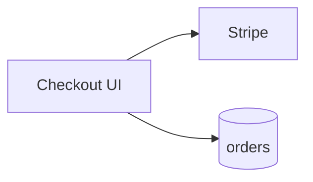
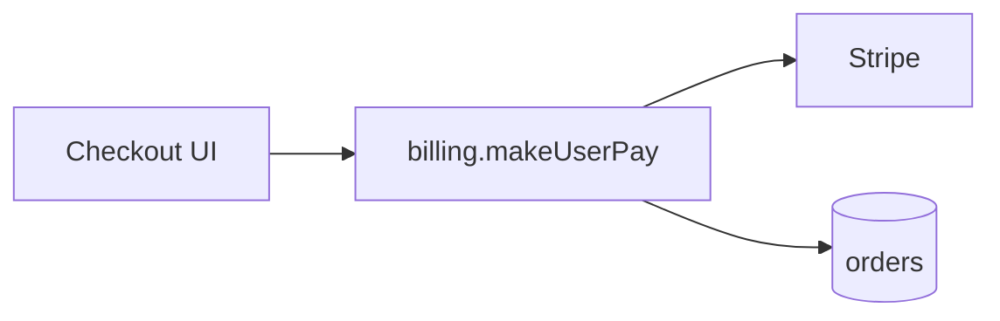
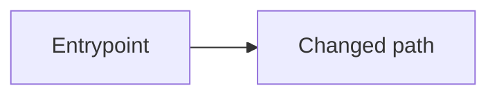

# Ship

Templates and steps for a branch and a pull request. The name pattern and the hard rules are in [shipping.md](../rules/shipping.md). Follow [pr-ship.md](pr-ship.md) for the create tool and the CI mirror.

## Change types and branch names

| Type | Branch prefix | Use when |
| --- | --- | --- |
| Feature | `feature/` | New capability or intentional enhancement |
| Tweak | `tweak/` | Small bounded intentional adjustment, not a defect or standalone capability |
| Bug | `bug/` | Defect fix, including an urgent production defect |
| Refactor | `refactor/` | Structural change with no intended product behavior change |
| Chore | `chore/` | Non-product maintenance: deps, CI, tooling, docs-only, repo hygiene |

```text
{type}/{ticket}-{slug}
```

- The type matches the ticket kind.
- `ticket`: Linear ID or GitHub issue number. `no-ticket` only when the user explicitly says there is no ticket.
- `slug`: lowercase kebab-case verb phrase. No spaces or colons; keep the name below roughly 60 characters.
- Examples: `bug/IN-1234-fix-checkout-total`, `tweak/IN-1234-adjust-empty-state-copy`, `feature/ENG-99-add-invite-flow`, `refactor/42-extract-billing-service`, `chore/IN-55-bump-eslint`.

## Type and ticket questions

```markdown
## Questions
Reply like: 1a 2a

1. Change type?
   - a) Feature ← recommended when this adds or enhances a capability
   - b) Tweak ← recommended when this is a small intentional adjustment, not a defect or standalone capability
   - c) Bug ← recommended when this fixes broken or wrong behavior, including an urgent production defect
   - d) Refactor ← recommended when this moves or cleans up debt without new behavior
   - e) Chore ← recommended when this is non-product maintenance (deps, CI, tooling, docs)
2. Ticket?
   - a) <detected IN-#### / #N> ← recommended when present
   - b) Other: paste a Linear ID, GitHub issue, or URL
   - c) no-ticket (you said there is none)
```

## Branch announcement

```markdown
## Locked in (tell me if this is wrong)
**Type:** Bug
**Ticket:** IN-1234
**Branch:** `bug/IN-1234-fix-checkout-total`
**Base:** `main`
**Push:** yes
```

## Draft and publish questions

```markdown
## Questions
Reply like: 1a

1. Draft a PR and publish it?
   - a) yes: show draft first, then publish ← recommended
   - b) no: stop after branch and push
   - c) draft only: show in chat, do not create
```

```markdown
## Questions
Reply like: 1a

1. Publish this PR as shown?
   - a) yes ← recommended
   - b) no: say what to edit
```

## Create command

Pick the write path in [pr-ship.md](pr-ship.md). Only when this harness has **no** pull-request tool:

```bash
gh pr create --title "<title>" --base <base> --body "$(cat <<'EOF'
<approved body>
EOF
)"
```

Title shape: `[IN-1234] Short imperative summary` or `[#42] Short imperative summary`.

## Change diagram (Mermaid), required on every PR

Every PR body has a **high-level** Mermaid diagram of what changed: modules, actors, and request/data flow, not every function or file.

| Shape of work | Diagrams |
| --- | --- |
| **New** (new capability, net-new path, additive tweak/chore) | One diagram under `## Change diagram` |
| **Rework** (refactor, structural move, bug that changes the flow) | `### Before` and `### After` under `## Change diagram` |

- Omit the section only when the diff is truly diagram-hostile (typo-only) and say why in Notes.
- Keep node labels short. Use `flowchart`, `sequenceDiagram`, or `graph`, whichever is clearest.
- Name real modules, services, or routes from the diff; do not invent architecture that is not in the change.
- For Before/After, keep the same node ids so the delta is obvious.
- Put the diagram after **What changed** and before **How to QA**.

Rework example:

````markdown
## Change diagram

### Before



### After


````

## PR body templates

Start from the base template, then apply the row for the locked type. A row's checkboxes replace the base `- [ ] Expected: …` line.

````markdown
## Type
<Feature | Tweak | Bug | Refactor | Chore>

## Ticket
<Linear URL or `IN-1234` · GitHub `#N`>

## What changed
- …

## Change diagram



## How to QA
1. …
2. …
- [ ] Expected: …

## Notes
- … (omit section if none)
````

| Type | What changed bullets | Change diagram | How to QA |
| --- | --- | --- | --- |
| Feature | `- …` | One diagram: `A[Entrypoint] --> B[New capability]` | Base steps; `- [ ] Expected: …` |
| Tweak | `- Adjusted: …` | One diagram: `A[Existing surface] --> B[Adjusted behavior]` | Step 2 `Confirm the intended adjustment: …`; `- [ ] Adjacent behavior remains unchanged` |
| Bug | `- Fixed: …` and `- Root cause (if known): …` | Before/After: `A[Trigger] --> B[Broken path]`, then `A[Trigger] --> B[Correct path]` | Step 1 `Repro steps that used to fail: …`; step 2 `Confirm expected behavior: …`; `- [ ] Bug no longer reproduces`; `- [ ] No obvious regression in adjacent flow` |
| Refactor | `- Moved or reshaped: …` and `- What must not change: …` | Before/After: `Caller --> OldShape[Old module/layout]`, then `Caller --> NewShape[New module/layout]` | Base steps; `- [ ] Behavior still holds`; `- [ ] No new product behavior landed with this PR` |
| Chore | `- Maintained: …` | One diagram: `Tooling[CI / deps / docs] --> Outcome[Maintenance outcome]` | Step 2 `Confirm maintenance outcome: …`; `- [ ] Intended maintenance landed`; `- [ ] No unintended product behavior change` |

## Process

### 1. Inspect git

In parallel, inspect `git status`, current branch, remotes/default base, commits ahead of base, and diff summary.

| State | Action |
| --- | --- |
| No pull-request tool, and no `gh` or not authenticated | Cut and push the branch as usual. Stop before the PR create step (section 6) and say why. The harness pull-request tool is preferred when present ([pr-ship.md](pr-ship.md)) |
| Dirty tree | Ask commit first, stash, or abort; never auto-commit. If that commit will be pushed, or a PR is already open on the branch, run the CI mirror in [pr-ship.md](pr-ship.md) first and push only when it is green |
| No commits ahead of base | Stop; there is nothing to publish |
| Detached HEAD | Create the standalone branch from that commit (section 3), then continue on it |

### 2. Lock type and ticket

Use the type and ticket questions unless both are already clear. If no ticket exists, ask once whether to stop and create one with `/write-ticket` (recommended) or use `no-ticket` because the user said there is none.

### 3. Branch and push

A new branch is a standalone ref. GitHub applies `dev`'s protection only when a push updates `dev`. Three common ways to do that by accident:

- `git switch -c <name> origin/dev` or `git checkout -b <name> origin/dev` sets upstream to `origin/dev` under the default `branch.autoSetupMerge` (`true`). `inherit` and `always` also copy it from a local `dev` that tracks `origin/dev`.
- A plain `git push` then fails and suggests `git push origin HEAD:dev`. That updates protected `dev`.
- With `push.default=upstream`, a plain `git push` updates `dev` and never creates the new remote ref.

The same trap exists for `main` and `master`.

1. Build `{type}/{ticket}-{slug}` from the locked values. The name is not `dev`, `main`, or `master`.
2. Announce the branch with the Locked block above.
3. Record the base SHA (`git rev-parse <base>`) and create the branch from that commit:

   ```bash
   git switch --detach <base-sha>
   git switch -c <new-branch>
   ```

   Same result in one command: `git switch --no-track -c <new-branch> <base-sha>`.

   Do not use `git switch -c` or `git checkout -b` from a remote ref without `--no-track`. Do not `git branch --set-upstream-to` `origin/dev`, `origin/main`, `origin/master`, or the default branch. End on the new branch: `git branch --show-current` prints `<new-branch>`.

   Reuse a local branch only when it already holds the intended commits and its upstream is unset or `origin/<new-branch>`. If `@{upstream}` is `origin/dev`, `origin/main`, or `origin/master`, run `git branch --unset-upstream` before any push. If the current branch is `dev`, `main`, or `master`, create the standalone branch before any commit. Rename only a disposable local branch that holds the intended commits, and only when upstream stays unset or `origin/<new-branch>`.
4. Unless the user asked for local-only work, check that `git rev-parse --abbrev-ref --symbolic-full-name @{upstream}` is unset or `origin/<new-branch>`. If it is `origin/dev`, `origin/main`, or `origin/master`, stop. Then push the new name only:

   ```bash
   git push -u origin HEAD:refs/heads/<new-branch>
   ```

5. Never force-push. Never `git push` with no refspec while upstream is `origin/dev`, `origin/main`, or `origin/master`. If git suggests `git push origin HEAD:dev`, `HEAD:main`, or `HEAD:master`, do not run it.

### 4. Ask whether to draft and publish

After a successful push, ask the draft and publish question and wait:

- Declined: return the branch and remote URL.
- Draft only: show it in chat and stop.
- Approved: continue to the full draft.

### 5. Draft the PR

Build the title and body from the commits, diff, ticket, and locked type with the PR body template. Keep **How to QA** concrete: paths, roles, clicks, commands, and checkable outcomes. Never ship empty QA steps.

Show the complete title and body, then ask the publish question. Never create a PR silently.

### 6. Publish

On approval only, create or update the PR with the tool choice in [pr-ship.md](pr-ship.md): the harness pull-request tool when it has one, otherwise the create command above. Return the PR URL. Do not write Linear comments or change ticket status.

## Do not

- Invent a ticket, or use a branch type that does not match the ticket kind.
- Implement new product work in the same turn as shipping.
