# Publish Reference

Load this when locking type/ticket, naming a branch, drafting a PR, or publishing.
Before create or update, also Read [../pack-shared/pr-ship.md](../pack-shared/pr-ship.md)
(which tool writes the PR). That file applies
to every agent that opens a PR, not only `/publish`.

## Change types and branch names

| Type | Branch prefix | Use when |
| --- | --- | --- |
| Feature | `feature/` | New capability or intentional enhancement |
| Tweak | `tweak/` | Small bounded intentional adjustment, not a defect or standalone capability |
| Bug | `bug/` | Defect fix (normal priority, not urgent production) |
| Refactor | `refactor/` | Structural change with no intended product behavior change |
| Chore | `chore/` | Non-product maintenance: deps, CI, tooling, docs-only, repo hygiene |
| Hotfix | `hotfix/` | Urgent production defect fix that needs expedited shipping |

```text
{type}/{ticket}-{slug}
```

- `ticket`: Linear ID, GitHub issue number, or `no-ticket` only after the user explicitly chooses it.
- `slug`: lowercase kebab-case verb phrase.
- No spaces or colons; keep below roughly 60 characters when practical.

Examples: `bug/IN-1234-fix-checkout-total`, `tweak/IN-1234-adjust-empty-state-copy`, `feature/ENG-99-add-invite-flow`, `refactor/42-extract-billing-service`, `chore/IN-55-bump-eslint`, `hotfix/IN-90-restore-checkout-payments`.

## Type and ticket questions

```markdown
## Questions
Reply like: 1a 2a

1. Change type?
   - a) Feature ← recommended when this adds or enhances a capability
   - b) Tweak ← recommended when this is a small intentional adjustment, not a defect or standalone capability
   - c) Bug ← recommended when this fixes broken or wrong behavior at normal priority
   - d) Refactor ← recommended when this moves or cleans up debt without new behavior
   - e) Chore ← recommended when this is non-product maintenance (deps, CI, tooling, docs)
   - f) Hotfix ← recommended when this is an urgent production defect fix
2. Ticket?
   - a) <detected IN-#### / #N> ← recommended when present
   - b) Other — paste a Linear ID, GitHub issue, or URL
```

## Branch announcement

```markdown
## Locked in (tell me if this is wrong)
**Type:** Bug
**Ticket:** IN-1234
**Branch:** `bug/IN-1234-fix-checkout-total`
**Base:** `main`
**Push:** yes
```

## Draft and publish questions

```markdown
## Questions
Reply like: 1a

1. Draft a PR and publish it?
   - a) yes — show draft first, then publish ← recommended
   - b) no — stop after branch and push
   - c) draft only — show in chat, do not create
```

```markdown
## Questions
Reply like: 1a

1. Publish this PR as shown?
   - a) yes ← recommended
   - b) no — say what to edit
```

## Create command

Pick the write path in [pr-ship.md](../pack-shared/pr-ship.md). Only when Cursor’s
pull-request tool is **not** available:

```bash
gh pr create --title "<title>" --base <base> --body "$(cat <<'EOF'
<approved body>
EOF
)"
```

Title shape: `[IN-1234] Short imperative summary` or `[#42] Short imperative summary`.

## Change diagram (Mermaid) — required on every PR

Every PR body must include a **high-level** Mermaid diagram of what changed.
Prefer modules, actors, and request/data flow — not every function or file.

| Shape of work | Diagrams |
| --- | --- |
| **New** (new capability, net-new path, additive tweak/chore) | One diagram under `## Change diagram` |
| **Rework** (refactor, structural move, bug/hotfix that changes the flow) | `### Before` and `### After` under `## Change diagram` |

Rules:

- Always try to include the section; omit only when the diff is truly diagram-hostile (e.g. typo-only) and say why in Notes.
- Keep node labels short; use `flowchart`, `sequenceDiagram`, or `graph` — pick the clearest form.
- Name real modules/services/routes from the diff when helpful; avoid inventing architecture that is not in the change.
- For Before/After, keep the same node ids where possible so the delta is obvious.
- Put the diagram **after What changed** and **before How to QA**.

### New-work example

````markdown
## Change diagram

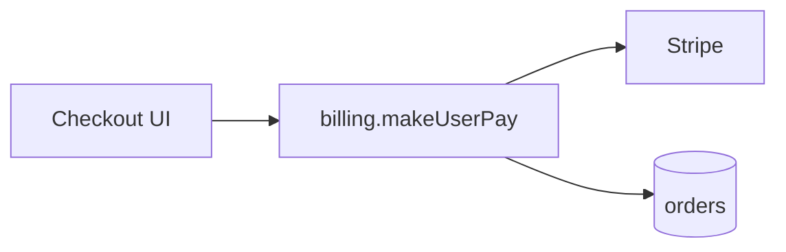
````

### Rework Before/After example

````markdown
## Change diagram

### Before

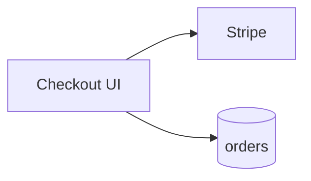

### After


````

## PR body templates

### Feature

````markdown
## Type
Feature

## Ticket
<Linear URL or `IN-1234` · GitHub `#N`>

## What changed
- …

## Change diagram

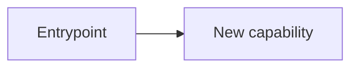

## How to QA
1. …
2. …
- [ ] Expected: …

## Notes
- … (omit section if none)
````

### Tweak

````markdown
## Type
Tweak

## Ticket
<Linear URL or `IN-1234` · GitHub `#N`>

## What changed
- Adjusted: …

## Change diagram

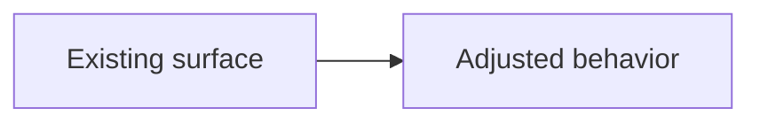

## How to QA
1. …
2. Confirm the intended adjustment: …
- [ ] Adjacent behavior remains unchanged

## Notes
- … (omit section if none)
````

### Bug

````markdown
## Type
Bug

## Ticket
<Linear URL or `IN-1234` · GitHub `#N`>

## What changed
- Fixed: …
- Root cause (if known): …

## Change diagram

### Before

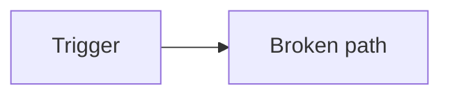

### After

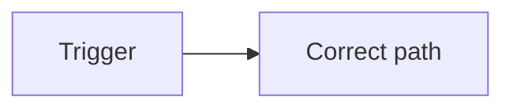

## How to QA
1. Repro steps that used to fail: …
2. Confirm expected behavior: …
- [ ] Bug no longer reproduces
- [ ] No obvious regression in adjacent flow

## Notes
- … (omit section if none)
````

### Refactor

````markdown
## Type
Refactor

## Ticket
<Linear URL or `IN-1234` · GitHub `#N`>

## What changed
- Moved or reshaped: …
- What must not change: …

## Change diagram

### Before

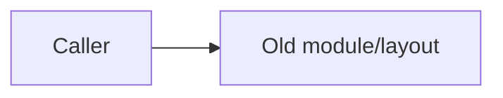

### After

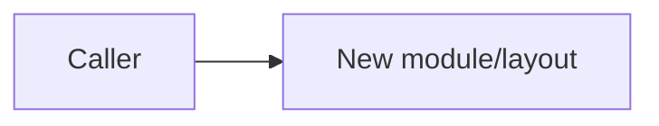

## How to QA
1. …
2. …
- [ ] Behavior still holds
- [ ] No new product behavior landed with this PR

## Notes
- … (omit section if none)
````

### Chore

````markdown
## Type
Chore

## Ticket
<Linear URL or `IN-1234` · GitHub `#N`>

## What changed
- Maintained: …

## Change diagram

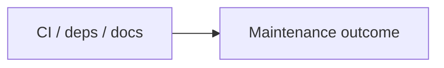

## How to QA
1. …
2. Confirm maintenance outcome: …
- [ ] Intended maintenance landed
- [ ] No unintended product behavior change

## Notes
- … (omit section if none)
````

### Hotfix

````markdown
## Type
Hotfix

## Ticket
<Linear URL or `IN-1234` · GitHub `#N`>

## What changed
- Fixed in production: …
- Root cause (if known): …

## Change diagram

### Before

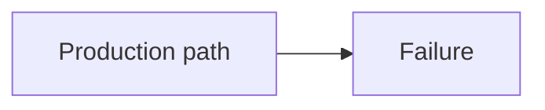

### After

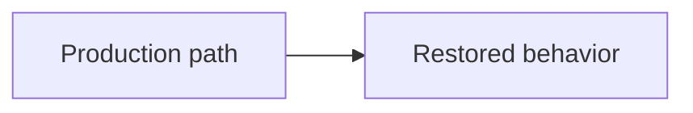

## How to QA
1. Repro steps that failed in production: …
2. Confirm expected behavior: …
- [ ] Production failure no longer reproduces
- [ ] No obvious regression in adjacent flow

## Notes
- Urgency / blast radius: …
- … (omit extra bullets if none)
````

## Process

Numbered how-to. Bars stay in [doctrine.md](doctrine.md).

### 1. Inspect git

In parallel, inspect `git status`, current branch, remotes/default base, commits ahead of base, and diff summary.

| State | Action |
| --- | --- |
| No `gh` or not authenticated | Stop before PR unless Cursor’s pull-request tool is available (see [pr-ship.md](../pack-shared/pr-ship.md)) |
| Dirty tree | Ask commit first, stash, or abort; never auto-commit. Before that commit, run this repo’s `lint` and `test` (`test:quality` when that is the test script) and fix failures so CI will not fail the PR |
| No commits ahead of base | Stop; there is nothing to publish |
| Detached HEAD | Create a real branch before continuing |

### 2. Lock type and ticket

Use the Question batch in this file unless both are already clear. If no ticket exists, ask once whether to use a descriptive `no-ticket` branch or stop and create a ticket first. Recommend `/write-ticket` when the work belongs on a tracker.

### 3. Branch and push

1. Build `{type}/{ticket}-{slug}` from the locked values.
2. Announce the branch in a Locked block from this file.
3. Create, rename, or reuse the branch. Only rename a disposable local branch that already holds the intended commits.
4. Unless the user asked for local-only work, push with `git push -u origin HEAD`.
5. Never force-push or push to `main`/`master`.

### 4. Ask whether to draft and publish

After a successful push, use the draft/publish Question batch in this file. Wait:

- Declined: return the branch and remote URL.
- Draft only: show it in chat and stop.
- Approved: continue to the full draft.

### 5. Draft the PR

Build the title and body from the commits, diff, ticket, and locked type. Use the type template in this file. Keep **How to QA** concrete: paths, roles, clicks, commands, and checkable outcomes. Include the Mermaid **Change diagram**: one diagram for new/additive work; **Before** and **After** for refactor, structural moves, and bug/hotfix flow changes.

Show the complete title and body, then use the publish-approval Question batch. Never create a PR silently.

### 6. Publish

On approval only, create or update the PR with the tool choice in [pr-ship.md](../pack-shared/pr-ship.md) (Cursor pull-request tool when available; otherwise the heredoc in this file). Return the PR URL. Do not write Linear comments or change ticket status.
