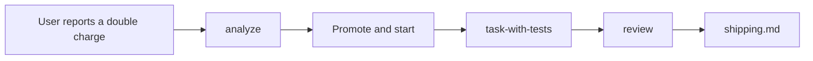

# Journey: a bug

Billing is the example domain; the vendor is not the point. The path and the shapes here beat the app's existing code. Copy an app sibling only when it matches the same shape ([cite a sibling](../code-quality.md#mechanical-rules)).

**The user says:** "A customer got charged twice at checkout."
**Comes after:** [a new Feature on a strong foundation](new-feature.md), whose Rule 1 says a retry with the same key never charges twice.

## 1. Route

The user reports a problem and asks for no fix yet. "Investigate a bug" matches the Skills table: open `analyze/SKILL.md`. A report that says "fix it" would go straight to `task-with-tests`.

## 2. Analyze

`/analyze` finds the code first, then judges it. When the open question is only how the charge path works, use `/how`. When it is only why the retry key is created on the click, use `/why`. The memo still owns the diagram and the execution seed:

- `billing.makeUserPay` honors a retry key, and its accepted test is green.
- `use-checkout.ts` creates a new retry key on every click, so a double click sends two keys. The rule holds at the service, and the caller defeats it.

The memo ends with an execution seed and the hand-off choices. The user picks Promote + start.

## 3. Build

`task-with-tests` runs with the memo as context.

1. **Grill.** Kind is Bug, so no new seam (a named extension point where a new variant plugs in) and no areas of modularity question ([Scale to the work](../strong-foundation.md#scale-to-the-work)). The fix belongs where the key is made: one key per order, created when the order is created. The rejected rival is disabling the Pay button, which is only UI feedback ([Authority](../code-structure.md#authority)).
2. **Tests prompt.** One test: two `makeUserPay` calls for one order from `useCheckout` create one charge. The user accepts it. It fails first, then passes after the fix.

## 4. Review and ship

`/review` checks safe to retry (Idempotency): a double submit must not duplicate the charge. That is a blocker if missing. The ship question defaults to no. On yes: branch `bug/IN-61-fix-double-charge`, then the PR title and body for approval.

[Verification scope](../execution.md#verification-scope) starts with the reproduced double-submit path, the accepted regression, and relevant existing payment tests and lint/type checks. This touches money and retry behavior, so inspect shared callers and broaden to relevant integration checks where needed. A small patch does not make a duplicate-charge fix low risk. Report actual results and any unverified scope; required CI still applies.

## If a step is skipped

- No analyze: the agent disables the button, and a slow network still double-charges.
- A new seam for a bug: ceremony with no area of modularity behind it.
