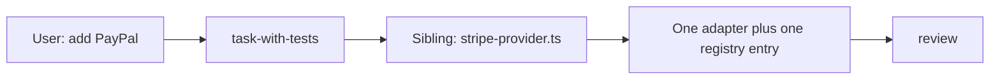

# Journey: a follow-up that fits the seam

Billing is the example domain; the vendor is not the point. The path and the shapes here beat the app's existing code. Copy an app sibling only when it matches the same shape ([cite a sibling](../code-quality.md#mechanical-rules)).

**The user says:** "Add PayPal as a payment option." No ticket, just the chat message.
**Comes after:** [a new Feature on a strong foundation](new-feature.md). **If it does not fit:** [a follow-up that needs a seam first](follow-up-needs-a-seam.md).



## 1. Route

"Add" matches the Skills table: open `task-with-tests/SKILL.md`. There is no ticket, so the grill works from the request and the repo ([strong-foundation.md](../strong-foundation.md#find-the-areas-of-modularity), source 3).

## 2. Grill, scaled to thin context

The agent finds the sibling first: `services/billing/providers.ts` already has a registry, and `stripe-provider.ts` implements `PaymentProvider`. Both match the Adapter and registry trees in [Foundation patterns](../code-structure-examples.md#foundation-patterns-folder-trees), so this sibling may be copied, and the agent says which tree it matches. That makes this a Feature that fits an existing seam ([Scale to the work](../strong-foundation.md#scale-to-the-work)): extend it, no new foundation, and no areas of modularity question.

Only real product questions remain:

```markdown
## Questions
Reply like: 1a

1. Who sees PayPal at checkout?
   - a) every customer, next to the card option recommended
   - b) only customers who choose it in settings
```

The Locked message says which seam this extends and names the public entry: `billing.makeUserPay` with `provider: "paypal"`.

## 3. Tests and build

The tests prompt offers one test: a PayPal payment through `makeUserPay` creates one charge with the PayPal adapter. The user accepts it.

The whole diff:

```text
services/billing/
  paypal-provider.ts    # new: implements PaymentProvider
  providers.ts          # one line: paypal: paypalProvider
features/checkout/
  payment-options.tsx   # PayPal option
```

`billing.ts` and `use-checkout.ts` do not change. That is the foundation paying off.

## 4. Review

`/review` runs the Foundation check, step 5: the diff adds a collaborator and its registration. If `billing.ts` had grown `if (provider === "paypal")`, that would be a blocker: a special case inside the foundation instead of a new piece.

## If a step is skipped

- No sibling lookup: the agent writes PayPal calls inside checkout, next to a seam that already exists.
- Copying a sibling that matches no example: had checkout called Stripe directly, copying it would add a second direct vendor call. Build from the Adapter tree instead.
- An areas of modularity question anyway: the user answers something the repo already answers.
