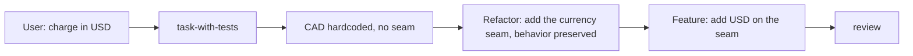

# Journey: a follow-up that needs a seam first

Billing is the example domain; the vendor is not the point. The path and the shapes here beat the app's existing code. Copy an app sibling only when it matches the same shape ([cite a sibling](../code-quality.md#mechanical-rules)). A seam is a named extension point where a new variant plugs in.

**The user says:** "US customers should pay in USD."
**Comes after:** [a new Feature on a strong foundation](new-feature.md), whose preparation settled "Currency: no".



## 1. Route and spot the gap

"Should pay in USD" asks for a change: open `task-with-tests/SKILL.md`. While finding siblings, the agent sees `"cad"` hardcoded in `billing.ts` and in `stripe-provider.ts`. Currency was settled as CAD only during preparation, so no seam exists. This is a Feature that fits no seam where one should now exist ([Scale to the work](../strong-foundation.md#scale-to-the-work)).

## 2. Grill the split

```markdown
## Questions
Reply like: 1a

1. Currency is hardcoded as CAD in `billing.ts` and `stripe-provider.ts`. How should USD land?
   - a) split: first a Refactor that passes a currency through `makeUserPay` with CAD everywhere (no behavior change), then the Feature that adds USD recommended
   - b) add a USD branch inside `billing.ts`
```

Option b bolts a special case onto the foundation, and the third currency repeats the same edit. The Locked in message repeats that rejected option.

## 3. Two builds, in order

1. **Refactor.** Remove the hardcoded value first ([keep-it-simple.md](../keep-it-simple.md#before-you-add), subtract first). `makeUserPay` takes a `currency`, and every current caller passes `"cad"`. Behavior is preserved. Existing tests stay green, and no new test is needed. When the user requests tickets separately, `/write-ticket` makes this its own implementation ticket (kind Refactor). It ships on its own branch: `refactor/IN-57-pass-currency-through-billing`.
2. **Feature.** Now USD fits the seam: checkout picks the currency from the customer's country. The tests prompt offers one test: a US customer's payment through `makeUserPay` is charged in USD.

## 4. Review

The Refactor diff is reviewed for preserved behavior. The Feature diff passes the Foundation check: USD arrives as a value on the seam, not as an `if` in the service.

## If a step is skipped

- No split: the special case ships, and the foundation now has one exception that every later change must know about.
- Refactor and Feature in one diff: review cannot tell a behavior change from a move.
