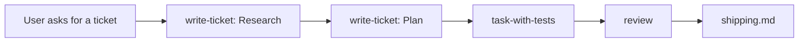

# Journey: a new Feature on a strong foundation

Billing is the example domain; the vendor is not the point. The path and the shapes here beat the app's existing code. Copy an app sibling only when it matches the same shape ([cite a sibling](../code-quality.md#mechanical-rules)).

**The user says:** "We need to take payments at checkout. Write a ticket for it."
**Next journey:** [add a provider that fits the seam](follow-up-fits-the-seam.md).



## 1. Route

"Write a ticket" matches the Skills table in `AGENTS.md`: open `write-ticket/SKILL.md`. The prompt names no stage, so one Questions batch asks for it. The problem is not understood yet, so Research is recommended.

## 2. Research ticket

1. `/analyze` writes a Research memo: checkout has no payment step, the team already has a Stripe account, and two customers asked for PayPal in support threads.
2. `/grill-me` runs the Research topics. Because this is a Feature, the topics include the areas of modularity ([strong-foundation.md](../strong-foundation.md#find-the-areas-of-modularity)):

```markdown
## Questions
Reply like: 1a 2a

1. Will there be more than one payment provider?
   - a) yes: Stripe now, PayPal asked for by two customers recommended
   - b) no: Stripe only
2. Will checkout charge in more than one currency?
   - a) no: CAD only for the next year recommended
   - b) yes
```

3. The user answers `1a 2a`. The Research body records facts, never a pattern:

```markdown
## Kind
Feature

## Areas of modularity
- Payment provider: yes, Stripe now, PayPal requested by two customers
- Currency: no, CAD only for the next year
```

## 3. Promote to Plan

On the same ticket, `/analyze` writes a Plan memo about the code that would change, and `/grill-me` runs the Plan topics. The decision and its rival:

- Chosen: a `billing` service with a `PaymentProvider` seam (a named extension point where a new variant plugs in), Stripe as the one real implementation.
- Rejected: Stripe calls inside the checkout feature. PayPal would then mean editing every caller.

Rules that must stay true come out of the grill: Rule 1, a retry with the same key never charges twice. Rule 2, only the order's owner can pay for it ([Authority](../code-structure.md#authority)).

```markdown
## Foundation
- Payment provider → `PaymentProvider` adapter, registry in `services/billing/`. Ships with Stripe only
- Currency → no seam (Research: CAD only)
- Next change this makes small: adding PayPal is one adapter file plus one registry entry
```

## 4. Build

The user says "build IN-42". "Build" matches the Skills table: open `task-with-tests/SKILL.md`.

1. **Grill.** The Plan ticket already settled the foundation, so no new areas question. The Locked in message names the public entry: `billing.makeUserPay`.
2. **Tests prompt.** One test per rule, each with a no. The user accepts both. They are written first and fail (the red baseline).
3. **Plan and slices.** Slice 1 builds the service and the seam. Slice 2 wires checkout to `makeUserPay`. Before each slice the agent opens [keep-it-simple.md](../keep-it-simple.md): one registry object, no provider factory, no currency seam.

```text
services/billing/
  billing.ts            # public: makeUserPay, refundPayment
  payment-provider.ts   # seam: the PaymentProvider interface
  providers.ts          # registry: { stripe: stripeProvider }
  stripe-provider.ts    # first real implementation
features/checkout/
  use-checkout.ts       # calls billing.makeUserPay
```

## 5. Review and ship

`/review` runs nested on the branch diff. The Foundation check passes: the provider area has a seam with one implementation, and currency has none because Research said no. Both accepted tests are green.

The ship question defaults to no. On yes, the agent opens [shipping.md](../shipping.md): branch `feature/IN-42-add-checkout-payments`, then the full PR title and body for approval before creating it.

## If a step is skipped

- No Research grill: nobody asks about providers, and Stripe gets hardcoded at every caller.
- No Foundation section: the builder guesses, and the next ticket is a rewrite.
- A seam on currency anyway: extra ceremony nobody asked for, and a keep it simple (KISS) finding at review.
