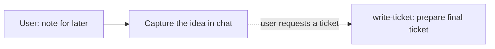

# Journey: a quick note

Billing is the example domain. This file shows the path, not the vendor.

**The user says:** "Note for later: Stripe webhooks that fail three times should alert someone."
**Later:** if the user requests a ticket, prepare it as in [a new Feature on a strong foundation](new-feature.md).

## 1. Capture the note

Keep the idea in the conversation: "Stripe webhooks that fail three times should alert someone." Do not invent current retry behavior, an alert recipient, or a tracker destination. A rough note does not start `/write-ticket`, an interview, or a build. If the user explicitly asks to save it elsewhere, honor that destination under [optional persistence](../planning.md#optional-persistence).

## 2. Prepare it when requested

When the user says "write an implementation ticket for that webhook alert," open `write-ticket/SKILL.md`. Research the actual retry path, restate the intended outcome in plain English, and settle the material choices, such as who receives the alert and what counts as repeated failure. Keep this preparation in the conversation, then write the final implementation-ready ticket. Follow that skill's contract; there is no intermediate note or research ticket.

## If a step is skipped

- Starting an interview from the note: the user wanted a quick capture, not a design session.
- Creating a tracker issue from the note alone: no ticket was requested.
- Starting `/task` from the note: nothing was asked to be built.
