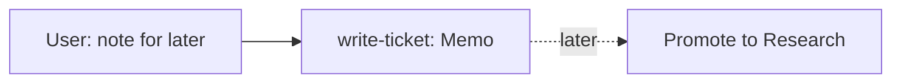

# Journey: a quick note

Billing is the example domain. This file shows the path, not the vendor.

**The user says:** "Note for later: Stripe webhooks that fail three times should alert someone."
**Later:** the note can grow into a Research ticket, as in [a new Feature on a strong foundation](new-feature.md).



## 1. Route

"Note for later" matches the Skills table: open `write-ticket/SKILL.md`. The prompt already says what it is, so the stage is Memo and no stage question is asked.

## 2. Memo

A Memo runs no `/analyze` and no `/grill-me`. The agent drafts the short note, shows it in a Locked message, and asks one metadata batch only if the tracker, priority, or assignee is missing. Then it writes the ticket. Status is Todo.

```markdown
## Stage
Memo

## Note
Stripe webhooks that fail three times in a row should alert someone. Today a failed webhook retries silently.
```

## 3. Later

When the team picks it up, the user says "promote IN-70 to Research". The same ticket goes through the Research steps of the new Feature journey: `/analyze`, then the grill. The Memo body is kept as a comment.

## If a step is skipped

- Grilling a Memo: the user wanted a ten-second note and got a questionnaire.
- Starting `/task` from the note: nothing was asked to be built.
