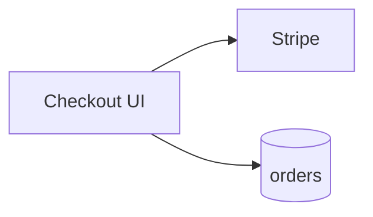
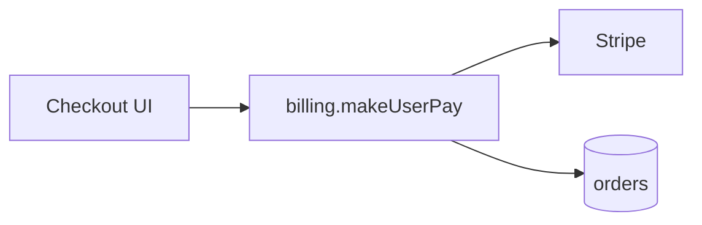
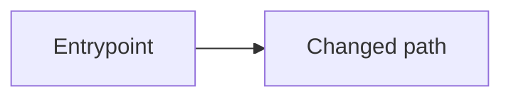

# Shipping templates

Question, announcement, and pull request body templates for [shipping.md](shipping.md). The rules and steps that use them live there.

## Questions and announcements

Shapes follow [Asking the user](writing-style.md#asking-the-user).

Type and ticket:

```markdown
## Questions
Reply like: 1a 2a

1. Change type?
   - a) Feature ← recommended when this adds or enhances a capability
   - b) Tweak ← recommended when this is a small intentional adjustment, not a defect or standalone capability
   - c) Bug ← recommended when this fixes broken or wrong behavior, including an urgent production defect
   - d) Refactor ← recommended when this moves or cleans up debt without new behavior
   - e) Chore ← recommended when this is non-product maintenance (deps, CI, tooling, docs)
2. Ticket?
   - a) <detected IN-#### / #N> ← recommended when present
   - b) Other: paste a Linear ID, GitHub issue, or URL
   - c) no-ticket (you said there is none)
```

Branch announcement:

```markdown
## Locked in (tell me if this is wrong)
**Type:** Bug
**Ticket:** IN-1234
**Branch:** `bug/IN-1234-fix-checkout-total`
**Base:** `main`
**Push:** yes
```

Draft and publish:

```markdown
## Questions
Reply like: 1a

1. Draft a PR and publish it?
   - a) yes: show draft first, then publish ← recommended
   - b) no: stop after branch and push
   - c) draft only: show in chat, do not create
```

```markdown
## Questions
Reply like: 1a

1. Publish this PR as shown?
   - a) yes ← recommended
   - b) no: say what to edit
```

## PR title and body

Title shape: `[IN-1234] Short imperative summary` or `[#42] Short imperative summary`.

### Change diagram

Every PR body has a **high-level** Mermaid diagram of what changed: modules, actors, and request/data flow, not every function or file.

| Shape of work | Diagrams |
| --- | --- |
| **New** (new capability, net-new path, additive tweak/chore) | One diagram under `## Change diagram` |
| **Rework** (refactor, structural move, bug that changes the flow) | `### Before` and `### After` under `## Change diagram` |

- Omit the section only when the diff is truly diagram-hostile (typo-only) and say why in Notes.
- Keep node labels short. Use `flowchart`, `sequenceDiagram`, or `graph`, whichever is clearest.
- Name real modules, services, or routes from the diff; do not invent architecture that is not in the change.
- For Before/After, keep the same node ids so the delta is obvious.
- Put the diagram after **What changed** and before **How to QA**.

Rework example:

````markdown
## Change diagram

### Before



### After


````

### Body template

Start from the base template, then apply the row for the locked type. A row's checkboxes replace the base `- [ ] Expected: …` line.

````markdown
## Type
<Feature | Tweak | Bug | Refactor | Chore>

## Ticket
<Linear URL or `IN-1234` · GitHub `#N`>

## What changed
- …

## Change diagram



## How to QA
1. …
2. …
- [ ] Expected: …

## Notes
- … (omit section if none)
````

| Type | What changed bullets | Change diagram | How to QA |
| --- | --- | --- | --- |
| Feature | `- …` | One diagram: `A[Entrypoint] --> B[New capability]` | Base steps; `- [ ] Expected: …` |
| Tweak | `- Adjusted: …` | One diagram: `A[Existing surface] --> B[Adjusted behavior]` | Step 2 `Confirm the intended adjustment: …`; `- [ ] Adjacent behavior remains unchanged` |
| Bug | `- Fixed: …` and `- Root cause (if known): …` | Before/After: `A[Trigger] --> B[Broken path]`, then `A[Trigger] --> B[Correct path]` | Step 1 `Repro steps that used to fail: …`; step 2 `Confirm expected behavior: …`; `- [ ] Bug no longer reproduces`; `- [ ] No obvious regression in adjacent flow` |
| Refactor | `- Moved or reshaped: …` and `- What must not change: …` | Before/After: `Caller --> OldShape[Old module/layout]`, then `Caller --> NewShape[New module/layout]` | Base steps; `- [ ] Behavior still holds`; `- [ ] No new product behavior landed with this PR` |
| Chore | `- Maintained: …` | One diagram: `Tooling[CI / deps / docs] --> Outcome[Maintenance outcome]` | Step 2 `Confirm maintenance outcome: …`; `- [ ] Intended maintenance landed`; `- [ ] No unintended product behavior change` |

