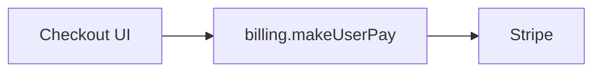
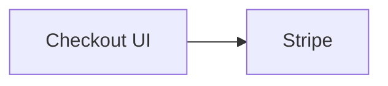
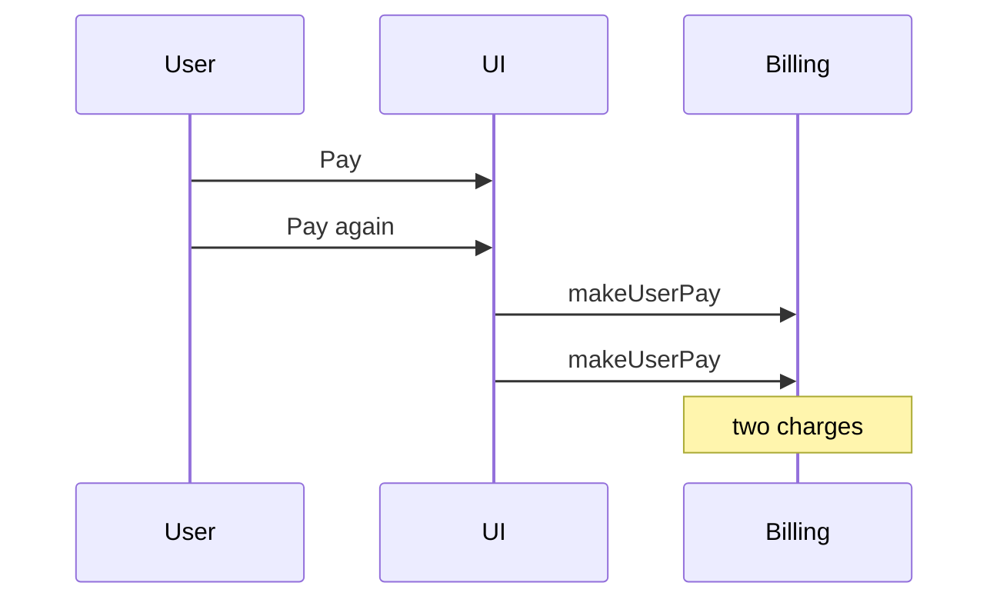
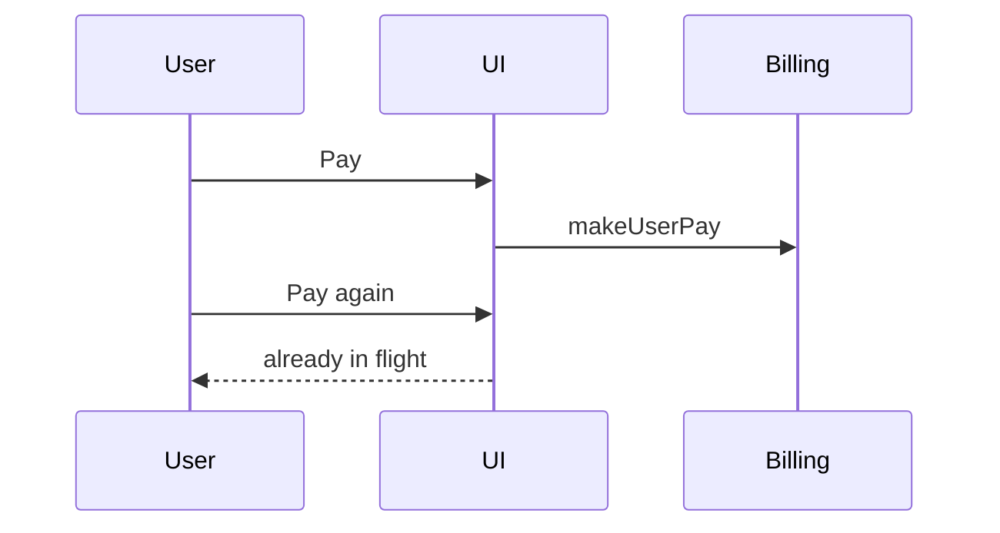

# Write Ticket Reference

Load when asking the allowed batches, announcing a solution, drafting a body, or writing metadata.

Ask only the batches in doctrine: too-short (once, if needed) and metadata (once, if still unknown). Omit any item the prompt, repo, or roster already answers. Never run a type-specific open grill.

## Too-short batch

Send this **only** when the seed cannot name an observable outcome, defect, or maintenance ask. One asking-contract batch. Include type only if it is still unknowable. Include priority, assignee, and tracker here when those are also missing so there is only one wait.

```markdown
## Questions
Reply like: 1a 2c 3a

1. What should this ticket capture?
   - a) <best one-sentence guess from the prompt + a quick repo look> ← recommended when you have a guess
   - b) <next-best guess>
   - c) Other — say the observable outcome, defect, or maintenance ask in one sentence
2. Ticket type?
   - a) Feature ← recommended when this is a new or enhanced capability
   - b) Tweak ← recommended when this is a small intentional adjustment, not a defect or standalone capability
   - c) Bug ← recommended when this is broken or wrong behavior at normal priority
   - d) Refactor ← recommended when this moves or cleans up debt without new behavior
   - e) Chore ← recommended when this is non-product maintenance (deps, CI, tooling, docs)
   - f) Hotfix ← recommended when this is an urgent production defect
3. Priority?
   - a) No priority or unset
   - b) Low
   - c) Medium ← recommended unless urgency is clear
   - d) High
   - e) Urgent
4. Assignee?
   - a) Unassigned ← recommended unless someone owns it
   - b) <current user if known>
   - c) <teammate from tracker roster>
   - d) Other — say who
5. Tracker?
   - a) <Linear or GitHub already used in this repo> ← recommended
   - b) The other tracker
   - c) Other — paste a team, repo, or URL
```

Drop questions 2–5 when already known. If there is no honest guess for question 1, keep one inferred option from the repo look plus `Other`. Do not invoke `/grill-me`. After answers, run full `/analyze` — do not send a second grill.

## Metadata batch

Use after analysis when the seed was enough but priority, assignee, or tracker is still unknown. Do not ask status (default **Todo** unless the prompt already names one). Do not ask “write this?”.

```markdown
## Questions
Reply like: 1c 2a

1. Priority?
   - a) No priority or unset
   - b) Low
   - c) Medium ← recommended unless urgency is clear
   - d) High
   - e) Urgent
   - f) Keep current ← when refining
2. Assignee?
   - a) Unassigned ← recommended unless someone owns it
   - b) <current user if known>
   - c) <teammate from tracker roster>
   - d) Keep current ← when refining
   - e) Other — say who
3. Tracker?
   - a) <Linear or GitHub already used in this repo> ← recommended
   - b) The other tracker
   - c) Other — paste a team, repo, or URL
```

Drop any item that is already known. Discover real options before asking: Linear priorities and members come from its capability; GitHub uses actual labels and collaborators. Status is **Todo** on create (map to the tracker’s Todo / To Do state; GitHub stays open) unless the prompt names another. When refining, keep the current status unless the prompt overrides it.

## Locked solution summary

Same shape for every type:

```markdown
## Locked in (tell me if this is wrong)
**Type:** Feature
**Ask:** …
**Done when:** …
**Out of scope:** … | _none_
**Start here:** `path` — `symbol` | _unknown_
```

## Body (every type)

Do not add or rename headings. Fill from the type preset below. Use `unknown` or `_none` when weak.

````markdown
## Type
Feature

## Diagram



## Ask
<plain sentences — see preset>

## Done when
- [ ] …

## Out of scope
- … | _none_

## Start here
- `path/to/file` — `symbol` | _unknown_
````

## Presets

What to write inside the shared sections. The picture still follows [Ticket diagrams](#ticket-diagrams).

### Feature

- **Diagram:** one path of what we’re adding
- **Ask:** what we’re adding, in plain words. One line on where it lives only if the picture needs it
- **Done when:** checks for the new behavior
- **Out of scope:** what we are not doing
- **Start here:** where to open the code

### Tweak

- **Diagram:** one path of the small change
- **Ask:** the small change
- **Done when:** what should be true after
- **Out of scope:** what must stay the same
- **Start here:** the screen, path, or file if known

### Bug

- **Diagram:** Before (broken) and After (good), or a race sequence
- **Ask:** what’s broken, who hits it, and when. Paste a stack trace here if you have one
- **Done when:** how to see it (repro steps as checks) and what good looks like
- **Out of scope:** what we are not fixing
- **Start here:** where the break likely starts

### Refactor

- **Diagram:** Before (current shape) and After (target shape)
- **Ask:** why the shape must change, what must keep working, and the honest cost in a few words
- **Done when:** structure is in place and behavior still holds
- **Out of scope:** what we are not moving
- **Start here:** the module or path to move

### Chore

- **Diagram:** path of the maintenance, or say why there is no picture
- **Ask:** what to land (deps, CI, docs, repo hygiene)
- **Done when:** what should be true after
- **Out of scope:** product behavior we are not changing
- **Start here:** the workflow, config, or file if known

### Hotfix

- **Diagram:** same as Bug (Before/After or race sequence)
- **Ask:** same as Bug, plus how bad it is in production and who is hit
- **Done when:** same as Bug
- **Out of scope:** what we are not fixing in this ship
- **Start here:** same as Bug

## Ticket diagrams

The **Diagram** section is the explanation. A teammate should get the feature,
bug, or race from the picture. Start from the analysis mermaid, then pick the
form below. Embed a real `mermaid` fence (GitHub and Linear render it).

| Situation | Picture |
| --- | --- |
| Feature, Tweak, or a chore with a path | One flowchart of the intended path |
| Bug, Hotfix, or Refactor that changes a flow | Before (broken/current) and After (good/target), same node ids |
| Race, ordering, double-submit, or concurrency | Sequence of the failing interleave, then the expected order |
| Typo, copy, or one-line chore | Skip the picture and say why under Diagram |

Keep it to modules, people, and request flow — not every file. Use real names
from the repo.

### Feature / intended path

````markdown
## Diagram


````

### Bug / flow change

````markdown
## Diagram

#### Before



#### After


````

### Race / ordering

````markdown
## Diagram

#### Failing interleave



#### Expected order


````
