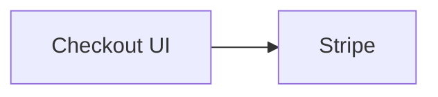
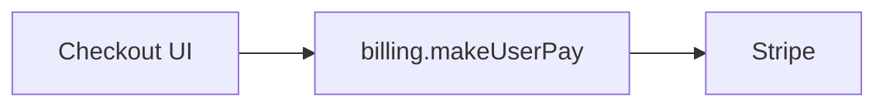
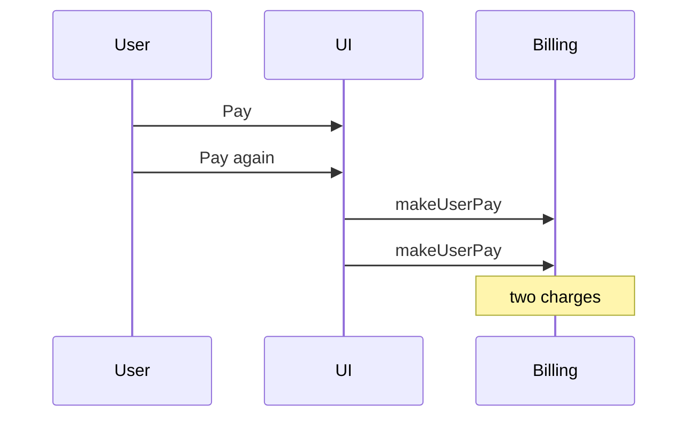
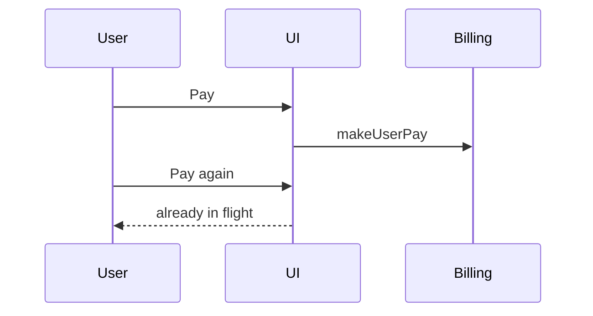

# Write Ticket reference

Load when asking the stage or metadata batch, drafting a body, or writing the tracker.

`/grill-me` owns the Research and Plan questions. This file owns the stage batch, the metadata batch, and the bodies.

## Stage batch

Send this only when the target stage is not already named. Include priority, assignee, and tracker when those are also missing so there is only one wait. Drop any item the prompt, the ticket, or the repo already answers.

When an existing ticket is loaded, recommend the next stage.

```markdown
## Questions
Reply like: 1b 2c 3a

1. Which stage should this ticket be?
   - a) Memo: save the idea, no research
   - b) Research: understand the need and the problem
   - c) Plan: specify how to solve it in code
2. Priority?
   - a) No priority or unset
   - b) Low
   - c) Medium ← recommended unless urgency is clear
   - d) High
   - e) Urgent
3. Assignee?
   - a) Unassigned ← recommended unless someone owns it
   - b) <current user if known>
   - c) <teammate from the tracker roster>
   - d) Other: say who
4. Tracker?
   - a) <Linear or GitHub already used in this repo> ← recommended
   - b) The other tracker
   - c) Other: paste a team, repo, or URL
```

Mark exactly one stage option as recommended. Memo when this is a reminder. Research when promoting a Memo. Plan when promoting Research, or when the prompt is already a build.

## Metadata batch

Use when the stage is already known but priority, assignee, or tracker is still unknown after the draft. Do not ask status. Do not ask "write this?".

```markdown
## Questions
Reply like: 1c 2a

1. Priority?
   - a) No priority or unset
   - b) Low
   - c) Medium ← recommended unless urgency is clear
   - d) High
   - e) Urgent
   - f) Keep current ← when refining or promoting
2. Assignee?
   - a) Unassigned ← recommended unless someone owns it
   - b) <current user if known>
   - c) <teammate from the tracker roster>
   - d) Keep current ← when refining or promoting
   - e) Other: say who
3. Tracker?
   - a) <Linear or GitHub already used in this repo> ← recommended
   - b) The other tracker
   - c) Other: paste a team, repo, or URL
```

Discover real options before asking. Linear priorities and members come from its capability. GitHub uses actual labels and collaborators. Status is **Todo** on create (map to the tracker's Todo state; GitHub stays open). On promote or refine, keep the current status unless the prompt names another.

## Locked draft

No Questions in this message. The user can correct it before the write when they reply. If they do not, write this draft.

### Memo

```markdown
## Locked in (tell me if this is wrong)
**Stage:** Memo
**Note:** …
```

### Research

```markdown
## Locked in (tell me if this is wrong)
**Stage:** Research
**Kind:** Feature | Tweak | Bug | Refactor | Chore
**Need:** …
**Problem:** …
**Out of scope:** … | _none_
```

### Plan

```markdown
## Locked in (tell me if this is wrong)
**Stage:** Plan
**Kind:** Feature
**Outcome:** …
**Done when:** …
**Tests:** none | behavior lock | end-to-end | both
**Out of scope:** … | _none_
**Start here:** `path` - `symbol` | _unknown_
```

## Bodies

Do not rename these headings. Use `_none` or `_unknown` only where the template allows it.

### Memo

```markdown
## Stage
Memo

## Note
<the idea in a few sentences>
```

No kind. No diagram.

### Research

Understanding only. No file map, no snippets, no design pattern.

```markdown
## Stage
Research

## Kind
Feature

## Need
<what people need>

## Problem
<what is wrong or missing>

## Who is affected
<who hits it, and when>

## What happens today
<current behavior>

## What we found
<evidence from the product and the repo about the problem>

## Settled in the grill
- <decision>

## Out of scope
- … | _none_
```

Kind is unset only when this is still a Memo. A Research ticket has a kind.

### Plan

How to solve the problem in code. A coding agent can implement from this body alone.

````markdown
## Stage
Plan

## Kind
Feature

## Outcome
<one plain sentence>

## Diagram

#### Before



#### After



## Rules that must stay true
- Rule 1: …

## Structure
- Folders: …
- Public API: …
- Design pattern: … | _none_
- Abstraction: … | _none_
- One-job helpers: … | _none_
- Deep module: … | _none_

## Files
- `path/to/file` - `symbol` - <what changes>

## Snippets
<short snippets only where a wrong guess would make the implementer ask>

## Done when
- [ ] …

## Out of scope
- … | _none_

## Start here
- `path/to/file` - `symbol`

## Tests
behavior lock: <what the lock proves>
end-to-end: <what the test proves>
or `none`

## Already decided
- <answer the implementer must not ask again>
````

`## Structure` uses `_none` on a row the change does not need. A one-line fix can set pattern, abstraction, one-job helpers, and deep module to `_none`, and still name the file.

`## Snippets` is `_none` only when every hard choice is already written in Rules, Structure, and Files.

`## Tests` is one of: `none`, a behavior lock, end-to-end, or both. Name what each lock proves.

## Plan diagrams

Start from the analysis mermaid. Embed a real `mermaid` fence. Use real names from the repo. Keep it to modules, people, and request flow.

| Situation | Picture |
| --- | --- |
| New path | One flowchart of the intended path |
| A change to an existing flow | Before and After, same node ids |
| Race, ordering, double-submit, or concurrency | Sequence of the failing interleave, then the expected order |
| Typo, copy, or one-line chore | No picture. Under Diagram, say why. |

### Intended path

````markdown
## Diagram


````

### Race

````markdown
## Diagram

#### Failing interleave



#### Expected order


````

## Tracker write

Set a label for the stage: `Memo`, `Research`, or `Plan`. On Research and Plan, also set the kind label when that label exists. The `## Stage` heading is the contract even when the label cannot be set.

On promotion, the comment is the previous description, unchanged. Then update the description.
