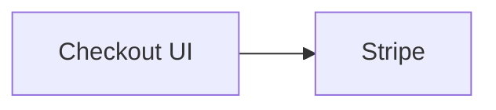
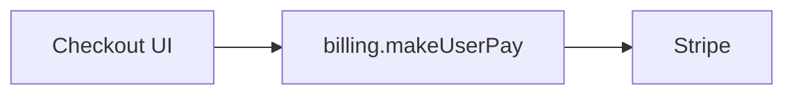
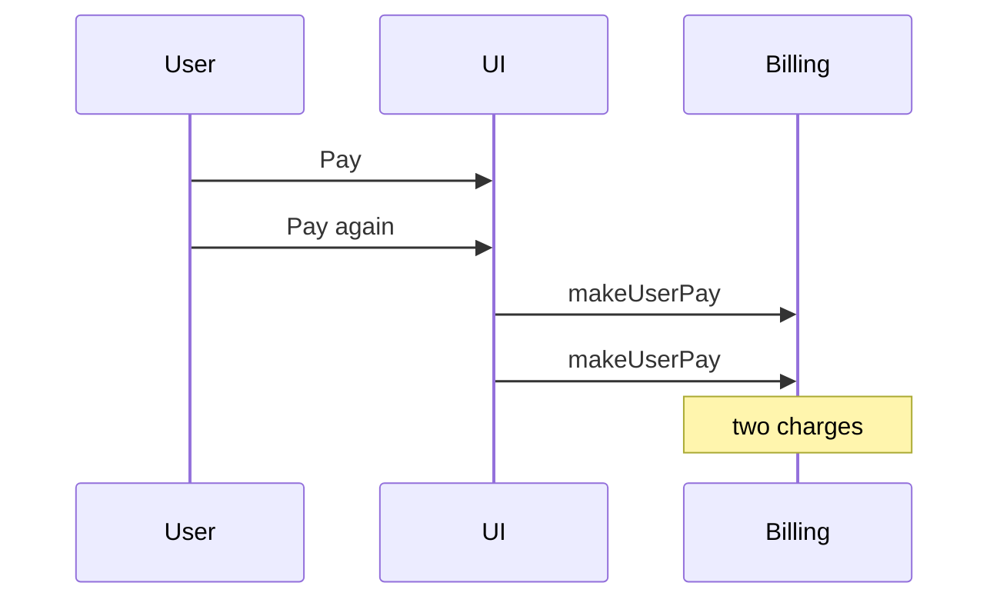
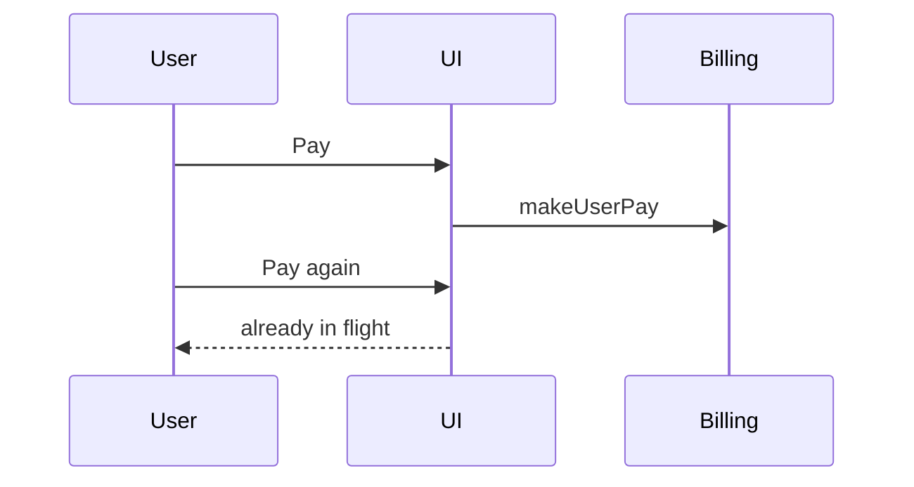

# Write Ticket reference

Load when asking the stage or metadata batch, drafting a body, or writing the tracker. `/grill-me` owns the Research and Plan questions.

## Stage batch

Send only when the target stage is not already named. Drop any item the prompt, the ticket, or the repo already answers. Append the missing [metadata batch](#metadata-batch) items (priority, assignee, tracker, renumbered, without the "Keep current" options) so there is only one wait.

```markdown
## Questions
Reply like: 1b 2c 3a

1. Which stage should this ticket be?
   - a) Memo: save the idea, no research
   - b) Research: understand the need and the problem
   - c) Plan: specify how to solve it in code
```

Mark exactly one stage as recommended: Memo for a reminder, Research when promoting a Memo, Plan when promoting Research or when the prompt is already a build. On an existing ticket, recommend the next stage.

## Metadata batch

Use when the stage is known but priority, assignee, or tracker is still unknown after the draft. Do not ask status. Do not ask "write this?".

```markdown
## Questions
Reply like: 1c 2a

1. Priority?
   - a) No priority or unset
   - b) Low
   - c) Medium ← recommended unless urgency is clear
   - d) High
   - e) Urgent
   - f) Keep current ← when refining or promoting
2. Assignee?
   - a) Unassigned ← recommended unless someone owns it
   - b) <current user if known>
   - c) <teammate from the tracker roster>
   - d) Keep current ← when refining or promoting
   - e) Other: say who
3. Tracker?
   - a) <Linear or GitHub already used in this repo> ← recommended
   - b) The other tracker
   - c) Other: paste a team, repo, or URL
```

Discover real options first: Linear priorities and members from its capability, GitHub labels and collaborators. Status is **Todo** on create (the tracker's Todo state; GitHub stays open). On promote or refine, keep the current status unless the prompt names another.

## Locked draft

No Questions in this message. If the user does not correct it, write this draft. Memo uses only **Stage** and **Note**.

```markdown
## Locked in (tell me if this is wrong)
**Stage:** Research | Plan
**Kind:** Feature | Tweak | Bug | Refactor | Chore
**Need:** …                     (Research)
**Problem:** …                  (Research)
**Outcome:** …                  (Plan)
**Done when:** …                (Plan)
**Tests:** none | behavior lock | end-to-end | both   (Plan)
**Out of scope:** … | _none_
**Start here:** `path` - `symbol` | _unknown_   (Plan)
```

## Bodies

Do not rename these headings. Use `_none` or `_unknown` only where the template allows it.

### Memo

No kind, no diagram.

```markdown
## Stage
Memo

## Note
<the idea in a few sentences>
```

### Research

Understanding only: no file map, no snippets, no design pattern. A Research ticket always has a kind.

```markdown
## Stage
Research

## Kind
Feature

## Need
<what people need>

## Problem
<what is wrong or missing>

## Who is affected
<who hits it, and when>

## What happens today
<current behavior>

## What we found
<evidence from the product and the repo about the problem>

## Settled in the grill
- <decision>

## Out of scope
- … | _none_
```

### Plan

A coding agent can implement from this body alone.

````markdown
## Stage
Plan

## Kind
Feature

## Outcome
<one plain sentence>

## Diagram

#### Before



#### After



## Rules that must stay true
- Rule 1: …

## Structure
- Folders: …
- Public API: …
- Design pattern: … | _none_
- Abstraction: … | _none_
- One-job helpers: … | _none_
- Deep module: … | _none_

## Files
- `path/to/file` - `symbol` - <what changes>

## Snippets
<short snippets only where a wrong guess would make the implementer ask>

## Done when
- [ ] …

## Out of scope
- … | _none_

## Start here
- `path/to/file` - `symbol`

## Tests
behavior lock: <what the lock proves>
end-to-end: <what the test proves>
or `none`

## Already decided
- <answer the implementer must not ask again>
````

- `## Structure`: `_none` on rows the change does not need. A one-line fix still names the file.
- `## Snippets`: `_none` only when Rules, Structure, and Files already settle every hard choice.
- `## Tests`: `none`, behavior lock, end-to-end, or both. Name what each lock proves.

## Plan diagrams

Start from the analysis mermaid. Embed a real `mermaid` fence with real repo names: modules, people, request flow.

| Situation | Picture |
| --- | --- |
| New path | One flowchart of the intended path (like the After fence above, under `## Diagram` with no Before/After subheads) |
| A change to an existing flow | Before and After, same node ids |
| Race, ordering, double-submit, or concurrency | Sequence of the failing interleave, then the expected order |
| Typo, copy, or one-line chore | No picture. Under Diagram, say why. |

### Race

````markdown
## Diagram

#### Failing interleave



#### Expected order


````

## Tracker write

Label the stage: `Memo`, `Research`, or `Plan`. On Research and Plan, also set the kind label when it exists. The `## Stage` heading is the contract even when a label cannot be set.

On promotion, post the previous description unchanged as a comment, then update the description.
