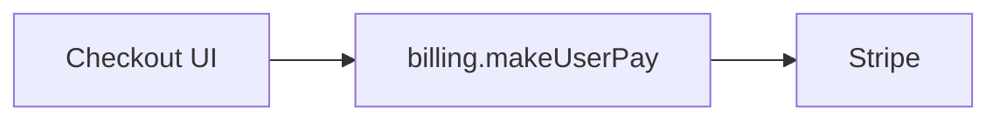
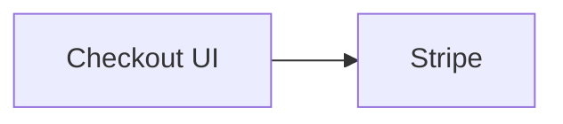
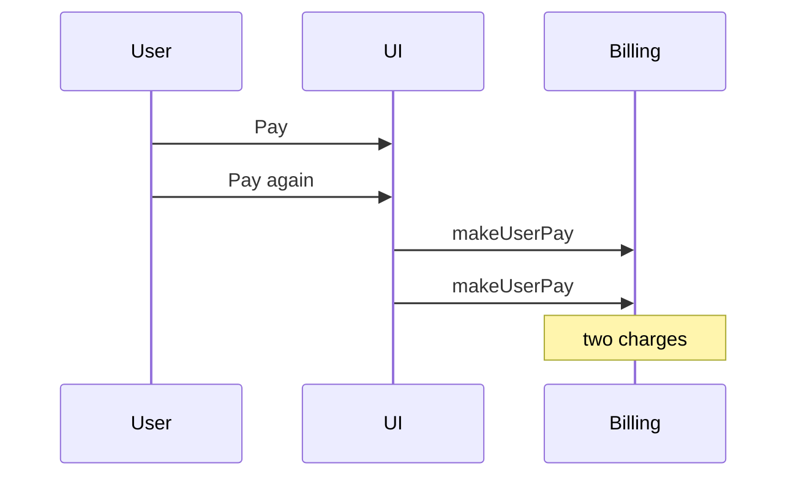
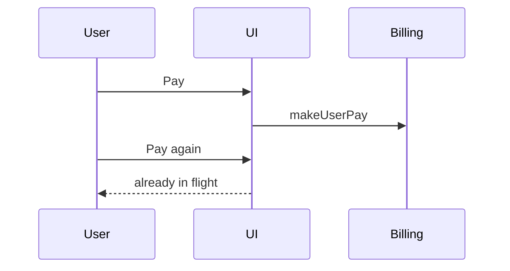
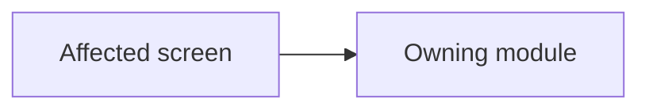
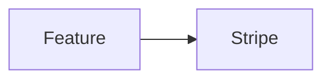
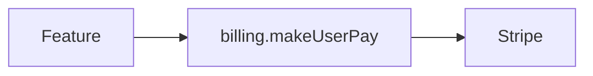
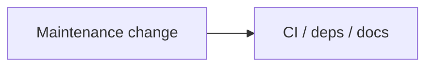

# Write Ticket Reference

Load when asking the allowed batches, announcing a solution, drafting a body, or writing metadata.

Ask only the batches in doctrine: too-short (once, if needed) and metadata (once, if still unknown). Omit any item the prompt, repo, or roster already answers. Never run a type-specific open grill.

## Too-short batch

Send this **only** when the seed cannot name an observable outcome, defect, or maintenance ask. One asking-contract batch. Include type only if it is still unknowable. Include priority, assignee, and tracker here when those are also missing so there is only one wait.

```markdown
## Questions
Reply like: 1a 2c 3a

1. What should this ticket capture?
   - a) <best one-sentence guess from the prompt + a quick repo look> ← recommended when you have a guess
   - b) <next-best guess>
   - c) Other — say the observable outcome, defect, or maintenance ask in one sentence
2. Ticket type?
   - a) Feature ← recommended when this is a new or enhanced capability
   - b) Tweak ← recommended when this is a small intentional adjustment, not a defect or standalone capability
   - c) Bug ← recommended when this is broken or wrong behavior at normal priority
   - d) Refactor ← recommended when this moves or cleans up debt without new behavior
   - e) Chore ← recommended when this is non-product maintenance (deps, CI, tooling, docs)
   - f) Hotfix ← recommended when this is an urgent production defect
3. Priority?
   - a) No priority or unset
   - b) Low
   - c) Medium ← recommended unless urgency is clear
   - d) High
   - e) Urgent
4. Assignee?
   - a) Unassigned ← recommended unless someone owns it
   - b) <current user if known>
   - c) <teammate from tracker roster>
   - d) Other — say who
5. Tracker?
   - a) <Linear or GitHub already used in this repo> ← recommended
   - b) The other tracker
   - c) Other — paste a team, repo, or URL
```

Drop questions 2–5 when already known. If there is no honest guess for question 1, keep one inferred option from the repo look plus `Other`. Do not invoke `/grill-me`. After answers, run full flow `/analyze` — do not send a second grill.

## Metadata batch

Use after analysis when the seed was enough but priority, assignee, or tracker is still unknown. Do not ask status (default **Todo** unless the prompt already names one). Do not ask “write this?”.

```markdown
## Questions
Reply like: 1c 2a

1. Priority?
   - a) No priority or unset
   - b) Low
   - c) Medium ← recommended unless urgency is clear
   - d) High
   - e) Urgent
   - f) Keep current ← when refining
2. Assignee?
   - a) Unassigned ← recommended unless someone owns it
   - b) <current user if known>
   - c) <teammate from tracker roster>
   - d) Keep current ← when refining
   - e) Other — say who
3. Tracker?
   - a) <Linear or GitHub already used in this repo> ← recommended
   - b) The other tracker
   - c) Other — paste a team, repo, or URL
```

Drop any item that is already known. Discover real options before asking: Linear priorities and members come from its capability; GitHub uses actual labels and collaborators. Status is **Todo** on create (map to the tracker’s Todo / To Do state; GitHub stays open) unless the prompt names another. When refining, keep the current status unless the prompt overrides it.

## Locked solution summaries

### Feature

```markdown
## Locked in (tell me if this is wrong)
**Vision:** …
**Definition of Done (outline):** …
**Entrypoints:** `path` — `symbol` · …
**Proposed architecture:** … (placement / reuse versus new service)
**Non-goals:** … | _none_
```

### Refactor

```markdown
## Locked in (tell me if this is wrong)
**Why:** …
**What must not change:** …
**Pros:** …
**Cons:** … (real costs)
**Impact:**
- **LoC** — affected: … · deleted: … · improved: …
- **Performance** — roundtrips: … · time: … · compute: …
- **Architecture** — structural: … · complexity: … · overhead: …
**Definition of Done (outline):** …
**Entrypoints:** `path` — `symbol` · …
**Proposed architecture:** … (target shape / move / delete old path)
**Non-goals:** … | _none_
```

### Tweak

```markdown
## Locked in (tell me if this is wrong)
**Adjustment:** …
**Expected outcome:** …
**Entrypoints:** `path` — `symbol` | _unknown_
**Non-goals:** … | _none_
```

### Chore

```markdown
## Locked in (tell me if this is wrong)
**Maintenance:** …
**Expected outcome:** …
**Entrypoints:** `path` — `symbol` | _unknown_
**Non-goals:** … | _none_
```

### Hotfix

```markdown
## Locked in (tell me if this is wrong)
**Who / What / When:** …
**Urgency / blast radius:** …
**Expected behavior:** …
**Repro:** … | _unknown_
```

## Refactor impact fields

| Pillar | Required sub-fields |
| --- | --- |
| Lines of code | Affected, Deleted, Improved |
| Performance | Roundtrips, Time, Compute |
| Architecture | Structural change, Complexity, Overhead |

Every field gets an estimate and short note.

## Ticket diagrams

The **Diagram** section explains the ticket. A teammate should get the feature,
bug, or race from the picture without reading the analysis memo. Start from
that memo’s mermaid, then pick the form below. Embed a real `mermaid` fence
(GitHub and Linear render it). Do not leave a copy-placeholder.

| Situation | Form |
| --- | --- |
| Feature, Tweak, or an additive Chore | One `flowchart` of the intended path |
| Bug, Hotfix, or Refactor that changes a flow | Before (broken/current) and After (expected/target), same node ids |
| Race, ordering, double-submit, or concurrency | `sequenceDiagram` of the failing interleave, then the expected order |
| Typo, copy, or one-line chore | Omit and say why under Diagram |

Prefer modules, actors, and request/data flow — not every file. Name real
owners from the repo.

### Feature / intended path

````markdown
## Diagram


````

### Bug / flow change (Before and After)

````markdown
## Diagram

#### Before



#### After


````

### Race / ordering

````markdown
## Diagram

#### Failing interleave



#### Expected order


````

## Ticket bodies

### Feature

````markdown
## Type
Feature

## Diagram


## Ask / Vision
<plain-language goal>

## Definition of Done
- Expected: …
- [ ] …

## Entrypoints
- `path/to/file` — `functionOrSymbol` — why this is the start

## Proposed architecture
- … (placement, reuse, or new service/module)
- Why: …

## Non-goals
- … (omit heading if none)

## Notes
- …
````

### Tweak

````markdown
## Type
Tweak

## Diagram



## Ask / Adjustment
<small intentional change>

## Definition of Done
- Expected: …
- [ ] …

## Entrypoints
- `path/to/file` — `functionOrSymbol` — why this surface changes
(omit heading if unknown)

## Non-goals
- … (omit heading if none)

## Notes
- …
````

### Bug

````markdown
## Type
Bug

## Diagram

#### Before


#### After


## Who
…

## What
…

## When
…

## Why
… (omit heading if unknown)

## How
1. …
2. …

## Stack trace
… (omit heading if none)

## What should happen if it worked
…

## Notes
- …
````

### Refactor

````markdown
## Type
Refactor

## Diagram

#### Before



#### After



## Ask / Why
<plain-language why the shape must change>

## What must not change
- …

## Pros
- …

## Cons
- … (real costs or risks)

## Impact

### Lines of code
- **Affected:** … — note: …
- **Deleted:** … — note: …
- **Improved:** … — note: …

### Performance
- **Roundtrips:** … — note: …
- **Time:** … — note: …
- **Compute:** … — note: …

### Architecture
- **Structural change:** … — note: …
- **Complexity:** … — note: …
- **Overhead:** … — note: …

## Definition of Done
- Structural: …
- Behavior still holds: …
- [ ] …

## Entrypoints
- `path/to/file` — `functionOrSymbol` — why this is in the lane

## Proposed architecture
- … (target shape / service / modules / old path removal)
- Why: …

## Non-goals
- … (omit heading if none)

## Notes
- …
````

### Chore

````markdown
## Type
Chore

## Diagram



## Ask / Maintenance
<non-product maintenance work>

## Definition of Done
- Expected: …
- [ ] …

## Entrypoints
- `path/to/file` — `functionOrSymbol` — why this surface changes
(omit heading if unknown)

## Non-goals
- … (omit heading if none)

## Notes
- …
````

### Hotfix

````markdown
## Type
Hotfix

## Diagram

#### Before


#### After


## Who
…

## What
…

## When
…

## Why
… (omit heading if unknown)

## Urgency / blast radius
…

## How
1. …
2. …

## Stack trace
… (omit heading if none)

## What should happen if it worked
…

## Notes
- …
````
