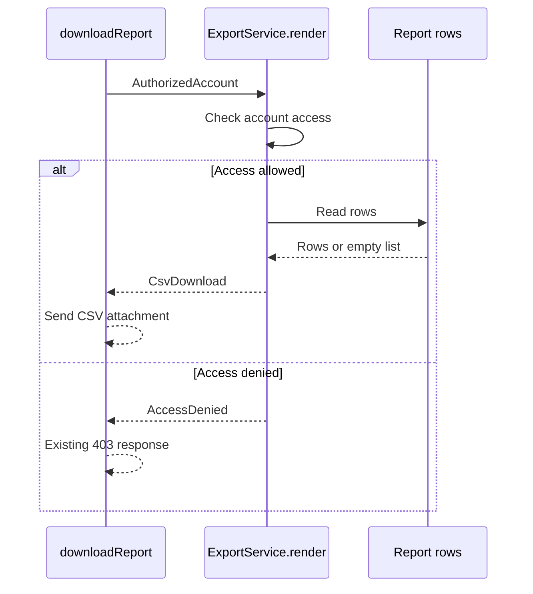
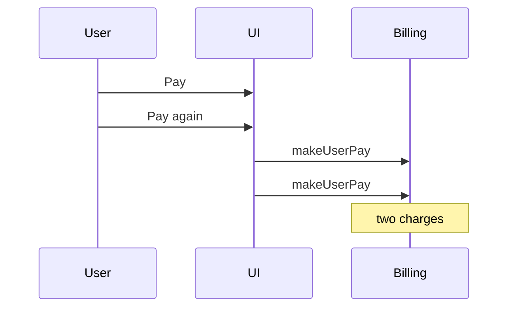
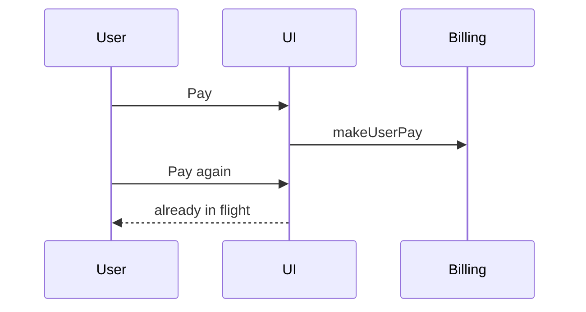

# Write Ticket reference

Load when drafting the final body, gathering missing tracker metadata, or writing. `/grill-me` owns the decisions. Preparation stays in chat.

## Metadata batch

Use only for an authorized tracker write when priority, assignee, or tracker is still unknown after the draft. Take status from the default below and write without asking "write this?".

```markdown
## Questions
Reply like: 1c 2a

1. Priority?
   - a) No priority or unset
   - b) Low
   - c) Medium ← recommended unless urgency is clear
   - d) High
   - e) Urgent
   - f) Keep current ← when updating
2. Assignee?
   - a) Unassigned ← recommended unless someone owns it
   - b) <current user if known>
   - c) <teammate from the tracker roster>
   - d) Keep current ← when updating
   - e) Other: say who
3. Tracker?
   - a) <Linear or GitHub already used in this repo> ← recommended
   - b) The other tracker
   - c) Other: paste a team, repo, or URL
```

Discover real options first: Linear priorities and members from its capability, GitHub labels and collaborators. Status is **Todo** on create (the tracker's Todo state; GitHub stays open). On update, keep the current status unless the prompt names another.

## Locked in message

Show the complete final body once, with no Questions, after readiness checks. It is the Locked-in draft; do not prepend a second summary repeating Outcome, Done when, Tests, or decisions. For an authorized write, use this body after resolving missing metadata. Draft-only returns this body as the final response. Use a brief changed-decision announcement earlier when needed under [Working output](../rules/writing-style.md#working-output).

````markdown
## Locked in (tell me if this is wrong)
<complete Plan body below, including delivery and children when split>
````

## Bodies

Use the headings below for relevant content, with Outcome and Work items first. Keep Kind as metadata rather than a standalone section. Retain Done when and Tests, including explicit refusals or `none: no tests specified`. Omit optional sections and rows that add no information instead of filling them with `_none`, `_unchanged`, or `_unknown`. Preserve meaningful exclusions, rationale, constraints, evidence, and bounded delegation. Missing material facts are readiness gaps, not empty placeholders. Draft text must already be final-version clean before write ([Final-version description](doctrine.md#final-version-description)).

### Plan

A coding agent can implement from this body alone. For split work, the parent uses this body for shared design and the overall outcome; each child uses it for its bounded outcome. Add the [stack handoff](#stack-handoff) to the parent and coordination fields to each child.

````markdown
**Kind:** Feature | Tweak | Bug | Refactor | Chore

## Outcome
- <who benefits and the observable outcome>
- <why this matters, grounded in intent and relevant evidence>

## Work items

### 1. <meaningful change or outcome>

- **Depends on:** <item number and required contract/state> | independent
- **Do:** <specific change and resulting behavior>
- **Why:** <reason for this change and chosen approach, with relevant evidence>
- **How:** <affected paths/public entries, concrete input/state to result behavior, named edge cases and constraints; reference shared context>
- **Verify:** <planned command or procedure and observable pass criteria; reference Tests for permission>

<fenced exact agreed contract beside this item when needed; shared contracts appear once and consumers reference their owner>

### 2. <next meaningful outcome, only when needed>

- **Depends on:** <item 1 and the specific contract/state it supplies> | independent
- **Do:** .
- **Why:** .
- **How:** .
- **Verify:** .

## Done when
- [ ] <overall observable acceptance>

## Tests
- <behavior lock or end-to-end; public entry and what it proves>: proposed | accepted | refused
- Decision source: <user instruction or recorded decision link; required for accepted/refused>
or `none: no tests specified`
````

Optional sections follow the work and acceptance, only when they carry relevant content:

- `## Diagram`: use the [diagram guidance](#plan-diagrams). A diagram specific to one item may sit beside that item instead.
- `## Rules that must stay true`: shared invariants with stable IDs, referenced from the owning items.
- `## Structure`: shared design only. For a material public boundary, record the owner/public entry, inputs, outcomes/errors, ordering, invariants, hidden caller work, representative before/after caller, and verification seam from [analysis](../analyze/doctrine.md#public-boundary-investigation). Use one canonical fenced block for an exact shared contract; reference it from local How/Verify. For a small change preserving a boundary, name its relevant constraints in the item and omit an empty architecture section.
- `## Foundation`: confirmed areas of modularity, their named seams, first real implementation, and next change made small. Name the existing seam being extended when applicable. Omit when the work needs no seam; do not invent future variants.
- `## Files` and `## Start here`: useful path-to-item index or entry pointer when paths are not already clear in the items. They are not a second plan.
- `## UX/UI`: include only for touched user flows, omitting irrelevant states. Record entry/context, purposeful actions by state, carried or editable data and next action, relevant recovery behavior, and existing presentation/component references. Apply [action and continuation](../rules/user-experience.md#action-and-continuation). Backend-only work omits this section.
- `## Out of scope`: meaningful exclusions that prevent credible mistakes.
- `## Already decided`: shared material decisions with reasons, evidence, uncertainty, and constraints; useful rejected alternatives; explicit delegation with choice, bounds, owner, and reason. Item-owned decisions stay in the items. An omitted decision is not delegated.

Follow the [implementation-item contract](doctrine.md#implementation-items). Use numbered headings and short labeled bullets for substantial items; group by outcome when useful. Order prerequisites before consumers and name the contract or state each dependency supplies. Numbering alone is not a dependency or PR boundary. One focused item is enough for a small change. Keep local Do/Why/How/Verify; a file list or global rationale cannot replace them. Leave ordinary coding choices open. These items are not linked subissues or permission to execute.

Preserve exact agreed signatures, types, payloads, examples, and values in fenced blocks beside their owning item or in Structure for a shared contract. Keep one canonical copy, referenced by consumers. Do not move contracts to a detached Snippets dump, replace meaningful prose with code, invent design to fill a block, or impose arbitrary word limits. Distinguish researched existing contracts, agreed changes, and illustrative examples. The body must resolve material behavior and contract ambiguity without sending the executor back to the old chat.

Tests retain their authorization format in every parent, child, or single-PR body. Quote the relevant user instruction when no durable decision link exists, rather than saying "approved earlier". Listing a test never authorizes writing it. Keep refused tests visible as permission constraints, and leave unsettled tests proposed. `none` means no tests specified, not a refusal inferred from silence. Verify describes future checks, not evidence that they ran.

### Worked work items

The following are illustrative, not repository facts or approved designs. Real tickets use researched paths and the user's actual decision source.

#### Small backend bug

```markdown
**Kind:** Bug

## Outcome
CSV callers get a header row for an empty report instead of a zero-byte download, so the existing importer can read the column names.

## Work items

### 1. Preserve CSV headers when there are no rows

- **Depends on:** independent.
- **Do:** Make `ExportService.render` in `src/export/service.ts` return `id,total\n` for an empty report; populated reports keep their existing header and rows.
- **Why:** The importer needs the schema even when the account has no data; the renderer already owns CSV formatting.
- **How:** Emit the existing `id,total` header before iterating rows. Preserve the renderer's account authorization and current escaping for commas and quotes. Change no route or public signature.
- **Verify:** After implementation, call the public renderer for an authorized empty account and inspect the exact bytes `id,total\n`; compare a populated report with the existing output and confirm a denied account still fails. Use existing checks or a safe manual call; see Tests.

## Done when
- [ ] Empty authorized reports contain the header; populated CSV and access denial keep their current behavior.

## Tests
- New automated empty-report test: refused.
- Decision source: user said "Use the existing checks and manual calls; don't add tests."
```

#### Multiple items with an agreed contract and useful diagram

Assume the user settled this exact contract and route behavior during grilling, and research confirmed the named entry points. The renderer is the single owner of the shared contract; the route consumes it.

````markdown
**Kind:** Feature

## Outcome
Authorized report callers can download CSV from the existing report route without coordinating authorization and rendering themselves.

## Work items

### 1. Expose the authorized CSV renderer

- **Depends on:** independent; reuses the existing account authority boundary.
- **Do:** Add `render` in `src/export/service.ts` with the agreed contract below.
- **Why:** The service owns authorization and CSV formatting so every caller gets the same rules.
- **How:** Reject a caller outside the account with the existing `AccessDenied` error before reading report rows. Return UTF-8 CSV bytes, including `id,total\n` for no rows, and the filename `report.csv`. Keep provider details inside the service.
- **Verify:** After implementation, use the public entry for populated, empty, and denied accounts. Inspect bytes and filename; denial must happen before row access. See Tests for the proposed lock and its unsettled permission.

Agreed shared contract (canonical copy):

```typescript
type CsvDownload = { bytes: Uint8Array; filename: "report.csv" };
render(account: AuthorizedAccount): Promise<CsvDownload>;
```

### 2. Return the attachment from the existing route

- **Depends on:** item 1 supplies `render` and `CsvDownload`.
- **Do:** Make `downloadReport` in `src/routes/report.ts` serve the renderer's bytes as an attachment.
- **Why:** Existing callers keep their route while the service owns account access and formatting.
- **How:** Resolve the account through the existing route boundary and consume item 1's contract. Send `Content-Type: text/csv; charset=utf-8` and `Content-Disposition: attachment; filename="report.csv"`. Map `AccessDenied` to the existing 403 response; other failures use the existing route error handler. Do not duplicate the row query or authorization policy in the route.
- **Verify:** After implementation, request the route as an allowed and denied caller; inspect the exact headers, CSV body (including the empty case), and unchanged 403 response. This is a planned manual check, not a pass.

## Done when
- [ ] The existing route returns the agreed CSV attachment for allowed accounts and preserves 403 for denied accounts.

## Tests
- Behavior lock through `render`: empty report and denial before row access, proposed (awaiting user decision).

## Diagram


```mermaid
sequenceDiagram
  participant Route as downloadReport
  participant Service as ExportService.render
  participant Rows as Report rows
  Route->>Service: AuthorizedAccount
  Service->>Service: Check account access
  alt Access allowed
    Service->>Rows: Read rows
    Rows-->>Service: Rows or empty list
    Service-->>Route: CsvDownload
    Route-->>Route: Send CSV attachment
  else Access denied
    Service-->>Route: AccessDenied
    Route-->>Route: Existing 403 response
  end
```
````

## Stack handoff

For a single PR, add `## Delivery` with `One PR` and the reason no split helps. For a split Plan, add the following to the parent and apply the [stack contract check](doctrine.md#stack-contract-check). Use draft keys (`A`, `B`) until the tracker returns IDs, then replace them with real links throughout the parent and children.

```markdown
## Delivery
One child per reviewable PR.
Integration branch: <actual repository branch>

| Order | Child | Outcome / parent done-when covered | Depends on | PR base |
| --- | --- | --- | --- | --- |
| 1 | <A: link and title> | <outcome and parent check> | none | <integration branch> |
| 2 | <B: link and title> | <outcome and parent check> | A | <A's branch> |

## Final verification
- <real flow proving the combined parent outcome after all children>

## Execute all children
Implement all children of <parent URL> in dependency order. Read the parent and every child first. Preserve their PR boundaries and recorded decisions. Honor explicit test acceptances and refusals; ask only about unresolved decisions or blockers. Run each child's review and verification, then the parent's final checks. Commit, push, and open one draft PR per child against its recorded base, with dependency links and a final stack summary. Continue through the whole stack without asking to start or publish each child. Do not merge.
```

Add this coordination block to each child's Plan:

```markdown
## Parent and dependencies
- Parent: <URL and shared outcome>
- Depends on: <child URLs or none>
- Required from predecessors: <public contract / migration state or none>
- PR base: <integration branch or predecessor branch>
- Scope and exclusions: <owned paths/symbols; work left to siblings>
- Safe intermediate state: <why this child works before later children land>
```

Each child's `## Tests` uses the common Plan format above for the check and its authorization. When refining an older Plan with `## Test decisions`, carry those statuses and sources into `## Tests` instead of maintaining two copies. When splitting an existing Plan, do not infer acceptance from its test list. Keep any unresolved decisions visible in the parent handoff.

Example: an export feature could have A add a working export service, B add the download endpoint on A, and C wire the UI on B. Each child has its own checks; the parent owns the final download flow. An unrelated settings cleanup stays outside this stack. Shared prerequisites precede their consumers; a PR base must already contain all code that child needs.

## Plan diagrams

Use a diagram when it makes relationships, state transitions, or execution order clearer than prose. Start from the relevant analysis mermaid when available. Embed a real `mermaid` fence with researched names. Preserve the settled flow; do not invent design to justify a picture. Omit Diagram when it adds no information.

| Situation | Picture |
| --- | --- |
| New path with useful relationships to show | One flowchart of the intended path (under `## Diagram` with no Before/After subheads) |
| A change to an existing flow best explained visually | Before and After, same node ids |
| Race, ordering, double-submit, or concurrency | Sequence of the failing interleave, then the expected order |
| Small local change with no useful flow or state relationship | Omit Diagram |

### Race

````markdown
## Diagram

#### Failing interleave


```mermaid
sequenceDiagram
  participant User
  participant UI
  participant Billing
  User->>UI: Pay
  User->>UI: Pay again
  UI->>Billing: makeUserPay
  UI->>Billing: makeUserPay
  Note over Billing: two charges
```

#### Expected order


```mermaid
sequenceDiagram
  participant User
  participant UI
  participant Billing
  User->>UI: Pay
  UI->>Billing: makeUserPay
  User->>UI: Pay again
  UI-->>User: already in flight
```
````

## Tracker write

Write only when the user requested a tracker create or update. Set the kind label when it exists; do not add stage headings or stage labels. Leave unrelated existing labels alone, including legacy stage labels unless the user requests their removal.

The description you write is the final version a reader needs. Delete canceled ideas, superseded decisions, demoted alternatives, strikethrough, and "was X / now Y". Do not patch that archaeology into the body.

On a material update, comment the previous description once when it would otherwise be lost, then replace it. A smaller refine rewrites the affected sections. Never leave old and new wording in the description.

For a split Plan:

1. Read existing children and dependency links first. Reuse matching children when refining or resuming; do not recreate them or reset their status. Preserve the existing parent ID and history.
2. Create the parent if needed, then create missing child Plan tickets in dependency order. Inherit the parent priority unless the plan gives a reason to differ. Use a child's own work kind (for example, Refactor before Feature). Inherit an assignee only when that person owns the whole set; otherwise leave the child unassigned. New children start in Todo.
3. Use the tracker's native parent/subissue and dependency relationships when available. Otherwise create real issues with explicit parent, child, and blocker links in their bodies and a linked checklist in the parent. Describe this fallback accurately; an inline checklist alone is not a set of created subissues.
4. Replace draft keys with returned IDs and URLs, derive branch names from those child IDs, and update the parent stack table and child links. Check that there are no dependency cycles, that each PR base supplies its prerequisites, and that every parent done-when item has an owner.
5. Read back the saved bodies and relationships. Return links, kind, applied metadata, parent/child relationships, and stack order where relevant. Do not print complete bodies or the whole-stack request again. Single-ticket writes use the same link-and-metadata handoff under [Working output](../rules/writing-style.md#working-output). If a write or relation fails, return the created URLs and the unfinished step; inspect those records before retrying so a partial run does not duplicate tickets.
