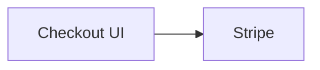
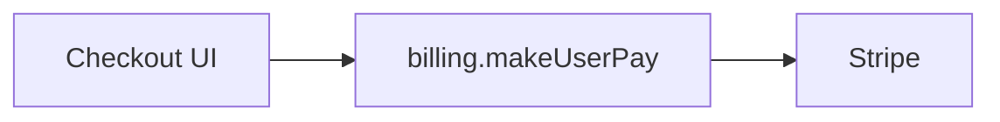
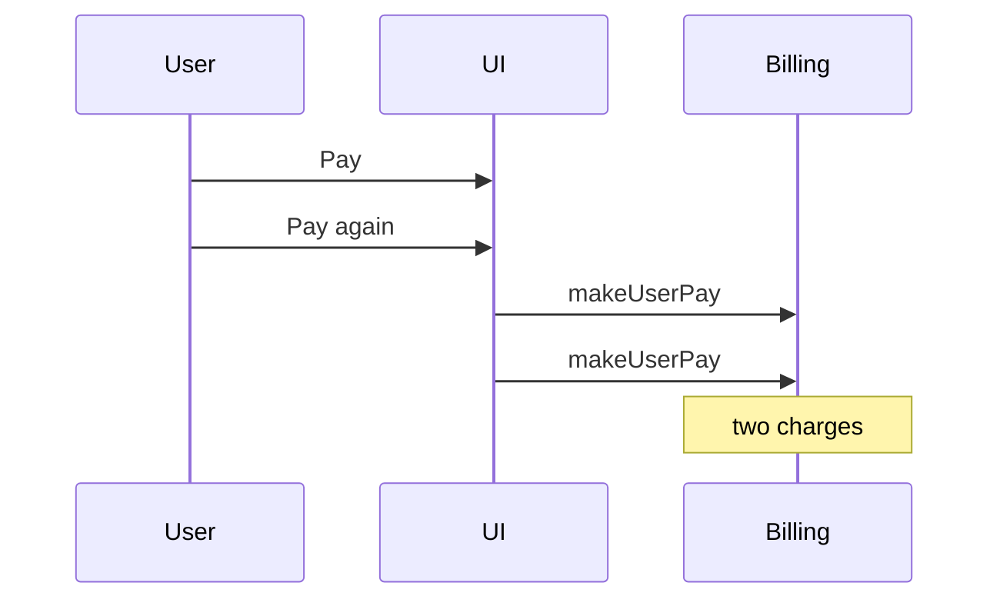
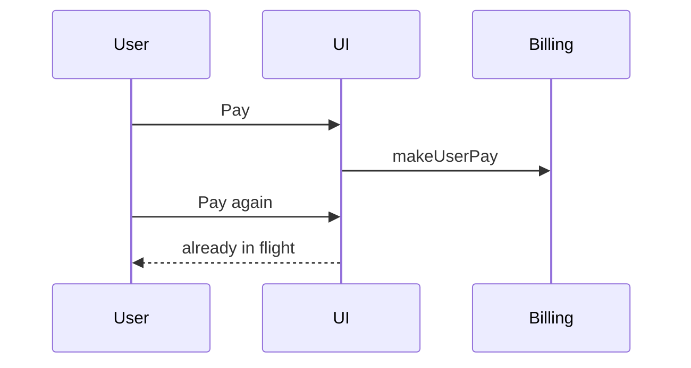

# Write Ticket reference

Load when drafting the final body, gathering missing tracker metadata, or writing. `/grill-me` owns the decisions. Preparation stays in chat.

## Metadata batch

Use only for an authorized tracker write when priority, assignee, or tracker is still unknown after the draft. Take status from the default below and write without asking "write this?".

```markdown
## Questions
Reply like: 1c 2a

1. Priority?
   - a) No priority or unset
   - b) Low
   - c) Medium ← recommended unless urgency is clear
   - d) High
   - e) Urgent
   - f) Keep current ← when updating
2. Assignee?
   - a) Unassigned ← recommended unless someone owns it
   - b) <current user if known>
   - c) <teammate from the tracker roster>
   - d) Keep current ← when updating
   - e) Other: say who
3. Tracker?
   - a) <Linear or GitHub already used in this repo> ← recommended
   - b) The other tracker
   - c) Other: paste a team, repo, or URL
```

Discover real options first: Linear priorities and members from its capability, GitHub labels and collaborators. Status is **Todo** on create (the tracker's Todo state; GitHub stays open). On update, keep the current status unless the prompt names another.

## Locked in message

Send the complete draft with no Questions. For an authorized write, use this draft after resolving missing metadata. Draft-only stays in chat. Draft text must already be final-version clean.

```markdown
## Locked in (tell me if this is wrong)
**Kind:** Feature | Tweak | Bug | Refactor | Chore
**Outcome:** …
**Done when:** …
**Tests:** <check and proposed | accepted | refused status, with decision source> | none
**Out of scope:** … | _none_
**Rejected:** <live alternative or exclusion and reason, when useful> | _none_
**Start here:** `path` - `symbol` | _unknown_
**Delivery:** one PR | parent with <N> child PRs
**Stack:** <ordered children and PR bases> | _none_
```

## Bodies

Keep these headings as written. Use `_none` or `_unknown` only where the template allows it. Draft text must already be final-version clean before write ([Final-version description](doctrine.md#final-version-description)).

### Plan

A coding agent can implement from this body alone. For split work, the parent uses this body for the shared design and overall outcome; each child uses it for its own bounded outcome. Add the [stack handoff](#stack-handoff) to the parent and the child coordination fields to each child.

````markdown
## Kind
Feature

## Outcome
- <who benefits and the observable outcome>
- <why this matters, grounded in the user's intent and relevant evidence>

## Diagram

#### Before


```mermaid
flowchart LR
  UI[Checkout UI] --> Stripe[Stripe]
```

#### After


```mermaid
flowchart LR
  UI[Checkout UI] --> Billing[billing.makeUserPay]
  Billing --> Stripe[Stripe]
```

## Rules that must stay true
- Rule 1: …

## Structure
- Folders: …
- Public API: …
- Abstraction: … | _none_
- One-job helpers: … | _none_
- Deep module: … | _none_

## Foundation
- <area of modularity> → <seam and pattern> + <first real implementation> | _none: Tweak, Bug, or Chore_
- <area the conversation ruled out> → no seam
- Extends existing seam: <seam> | _none_
- Next change this makes small: <request> → <one new file + one registration>

## Files
- `path/to/file` - `symbol` - <work item number>

## Work items
1. <meaningful change or outcome>
   - Depends on: <item number and required contract/state> | independent
   - Do: <specific change and resulting behavior>
   - Why: <reason for this change and chosen approach, with relevant evidence>
   - How: <concrete code/data/contract approach and constraints; cite shared context briefly>
   - Verify: <observable expected result and planned check; reference Tests for test status>
2. <next meaningful change or outcome, when needed>
   - Depends on: <item number and required contract/state> | independent
   - Do: .
   - Why: .
   - How: .
   - Verify: .

## Snippets
<short snippets only where a wrong guess would make the implementer ask>

## Done when
- [ ] …

## Out of scope
- … | _none_

## Start here
- `path/to/file` - `symbol`

## Tests
- <behavior lock or end-to-end; public entry and what it proves>: proposed | accepted | refused
- Decision source: <user instruction or recorded decision link; required for accepted/refused>
or `none: no tests specified`

## Already decided
- Rejected: <live alternative or exclusion and reason, when useful> | _none_
- <shared material decision: chosen behavior or shape, reason, evidence or uncertainty, and constraints; refer to item numbers for item-owned decisions>
- <explicitly delegated choice, its bounds, decision owner, and why discretion is acceptable> | _none_
````

- `## Foundation`: a seam is a named extension point where a new variant plugs in.
- `## Structure`: shared design only; item-specific approaches belong in Work items. Use `_none` on rows the change does not need. A one-line fix still names the file. The owner path is still named.
- `## Outcome`: keep the outcome and reason on short separate lines. Include only the evidence needed to understand the current goal, with specific source pointers; do not copy the analysis memo.
- `## Work items`: follow the [implementation-item contract](doctrine.md#implementation-items). Use as many items as meaningful outcomes require, including one for a small change. Order dependencies before consumers and identify the supplied contract or state. Each item needs local Do, Why, How, and Verify; brief references can carry shared context, but cannot replace an item's specific reason and approach. Leave routine coding choices open. These items are not linked subissues or permission to execute.
- `## Files`: a compact path-to-item index, not a second implementation plan. `## Done when` states overall acceptance; each item's Verify states its local observable check without duplicating the whole acceptance list.
- `## Already decided`: keep shared decisions, useful live exclusions, and bounded delegation here; item-owned decisions and reasons stay in their items. Preserve relevant evidence and uncertainty in historical inferences. A live rejected alternative belongs only when it prevents a credible mistake; `_none` is allowed. Explicit delegation names the choice, bounds, owner, and reason; an omitted decision is not delegated.
- `## Snippets`: `_none` only when Rules, Structure, and Work items already settle every hard choice.
- `## Tests`: use this authorization format for every Plan, including a single PR. Record each test's status and settled decision source; quote the relevant user instruction when no durable link exists, rather than saying "approved earlier". Listing a test never authorizes writing it. Keep refused tests visible as permission constraints, and leave unsettled tests proposed.

### Worked work items

Illustrative excerpt, not repository facts: assume research found `ExportService.render` returns CSV bytes for an authorized account, `downloadReport` serves the existing report download route, and the report screen has a download action and error display. The user settled that this route will download those bytes; no new tests are authorized. The real ticket must use researched paths and preserve the actual test decision source in Tests.

```markdown
## Work items
1. Return the CSV download from the existing route
   - Depends on: independent; uses the existing authorized-account contract of ExportService.render.
   - Do: Make downloadReport return the rendered CSV as an attachment.
   - Why: The settled design reuses the existing download route, so callers keep the same entry point.
   - How: In downloadReport, pass the account from the existing authorization boundary to ExportService.render; send its bytes with text/csv and an attachment filename. Preserve the route's current access-denial behavior.
   - Verify: After implementation, check that an authorized download contains the service's CSV bytes and attachment headers, and denied access still returns the existing denial response. Use existing checks or a safe manual request; see Tests for the new-test constraint.
2. Connect the report screen to the download
   - Depends on: item 1 supplies the CSV attachment response at the existing route.
   - Do: Make the report screen's download action request that route.
   - Why: Users need the report from the screen where they select it; using the route preserves the settled authorization boundary.
   - How: Point the screen's existing download action at downloadReport and use the existing error display when the request fails. Leave CSV rendering in ExportService.
   - Verify: After implementation, activate the action for an authorized account and inspect the saved CSV; a failed request shows the existing error display. This is a planned manual check, not evidence that it has run.
```

## Stack handoff

For a single PR, add `## Delivery` with `One PR` and the reason no split helps. For a split Plan, add the following to the parent. Use draft keys (`A`, `B`) until the tracker returns IDs, then replace them with real links throughout the parent and children.

```markdown
## Delivery
One child per reviewable PR.
Integration branch: <actual repository branch>

| Order | Child | Outcome / parent done-when covered | Depends on | PR base |
| --- | --- | --- | --- | --- |
| 1 | <A: link and title> | <outcome and parent check> | none | <integration branch> |
| 2 | <B: link and title> | <outcome and parent check> | A | <A's branch> |

## Final verification
- <real flow proving the combined parent outcome after all children>

## Execute all children
Implement all children of <parent URL> in dependency order. Read the parent and every child first. Preserve their PR boundaries and recorded decisions. Honor explicit test acceptances and refusals; ask only about unresolved decisions or blockers. Run each child's review and verification, then the parent's final checks. Commit, push, and open one draft PR per child against its recorded base, with dependency links and a final stack summary. Continue through the whole stack without asking to start or publish each child. Do not merge.
```

Add this coordination block to each child's Plan:

```markdown
## Parent and dependencies
- Parent: <URL and shared outcome>
- Depends on: <child URLs or none>
- Required from predecessors: <public contract / migration state or none>
- PR base: <integration branch or predecessor branch>
- Scope and exclusions: <owned paths/symbols; work left to siblings>
- Safe intermediate state: <why this child works before later children land>
```

Each child's `## Tests` uses the common Plan format above for the check and its authorization. When refining an older Plan with `## Test decisions`, carry those statuses and sources into `## Tests` instead of maintaining two copies. When splitting an existing Plan, do not infer acceptance from its test list. Keep any unresolved decisions visible in the parent handoff.

Example: an export feature could have A add a working export service, B add the download endpoint on A, and C wire the UI on B. Each child has its own checks; the parent owns the final download flow. An unrelated settings cleanup stays outside this stack. Shared prerequisites precede their consumers; a PR base must already contain all code that child needs.

## Plan diagrams

Start from the analysis mermaid. Embed a real `mermaid` fence with real repo names: modules, people, request flow.

| Situation | Picture |
| --- | --- |
| New path | One flowchart of the intended path (like the After fence above, under `## Diagram` with no Before/After subheads) |
| A change to an existing flow | Before and After, same node ids |
| Race, ordering, double-submit, or concurrency | Sequence of the failing interleave, then the expected order |
| Typo, copy, or one-line chore | No picture. Under Diagram, say why. |

### Race

````markdown
## Diagram

#### Failing interleave


```mermaid
sequenceDiagram
  participant User
  participant UI
  participant Billing
  User->>UI: Pay
  User->>UI: Pay again
  UI->>Billing: makeUserPay
  UI->>Billing: makeUserPay
  Note over Billing: two charges
```

#### Expected order


```mermaid
sequenceDiagram
  participant User
  participant UI
  participant Billing
  User->>UI: Pay
  UI->>Billing: makeUserPay
  User->>UI: Pay again
  UI-->>User: already in flight
```
````

## Tracker write

Write only when the user requested a tracker create or update. Set the kind label when it exists; do not add stage headings or stage labels. Leave unrelated existing labels alone, including legacy stage labels unless the user requests their removal.

The description you write is the final version a reader needs. Delete canceled ideas, superseded decisions, demoted alternatives, strikethrough, and "was X / now Y". Do not patch that archaeology into the body.

On a material update, comment the previous description once when it would otherwise be lost, then replace it. A smaller refine rewrites the affected sections. Never leave old and new wording in the description.

For a split Plan:

1. Read existing children and dependency links first. Reuse matching children when refining or resuming; do not recreate them or reset their status. Preserve the existing parent ID and history.
2. Create the parent if needed, then create missing child Plan tickets in dependency order. Inherit the parent priority unless the plan gives a reason to differ. Use a child's own work kind (for example, Refactor before Feature). Inherit an assignee only when that person owns the whole set; otherwise leave the child unassigned. New children start in Todo.
3. Use the tracker's native parent/subissue and dependency relationships when available. Otherwise create real issues with explicit parent, child, and blocker links in their bodies and a linked checklist in the parent. Describe this fallback accurately; an inline checklist alone is not a set of created subissues.
4. Replace draft keys with returned IDs and URLs, derive branch names from those child IDs, and update the parent stack table and child links. Check that there are no dependency cycles, that each PR base supplies its prerequisites, and that every parent done-when item has an owner.
5. Read back the saved bodies and relationships. Report the parent, children, order, and whole-stack request. If a write or relation fails, return the created URLs and the unfinished step; inspect those records before retrying so a partial run does not duplicate tickets.
