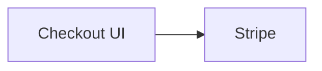
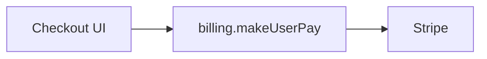
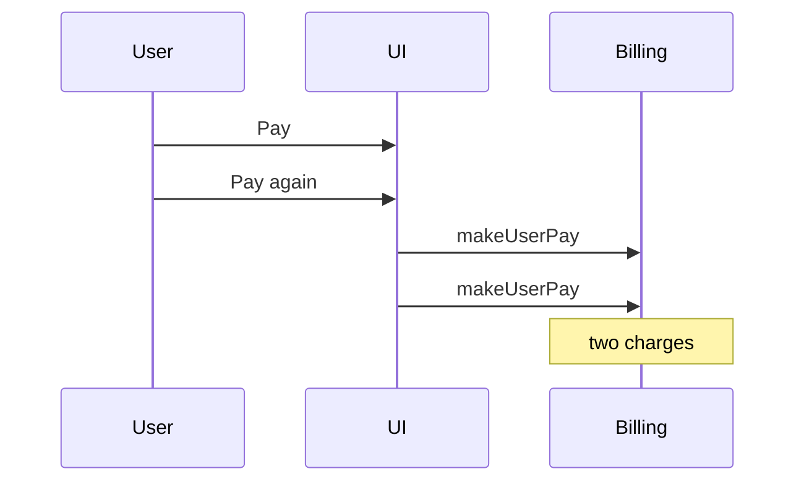
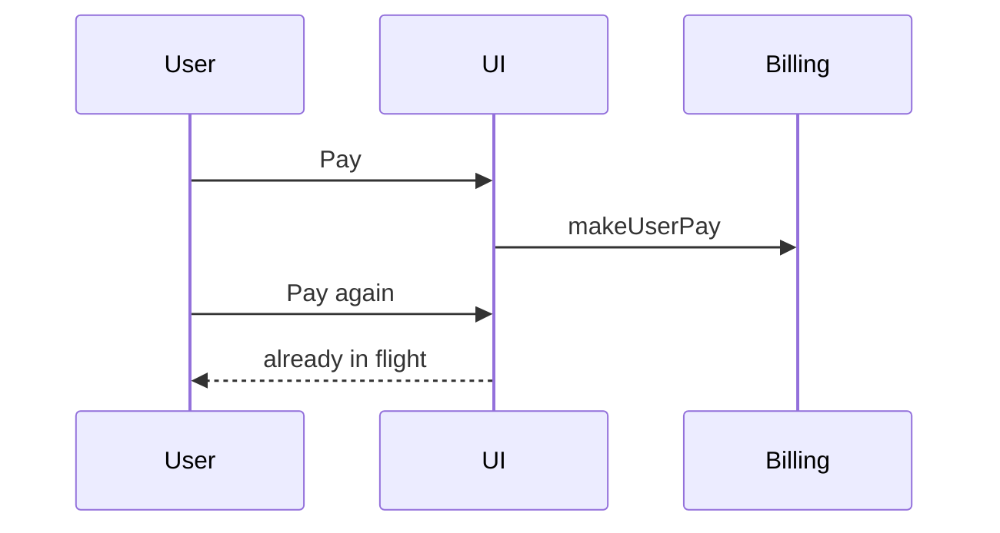

# Write Ticket reference

Load when asking the stage or metadata batch, drafting a body, or writing the tracker. `/grill-me` owns the Research and Plan questions.

## Stage batch

Send only when the target stage is not already named. Drop any item the prompt, the ticket, or the repo already answers. Append the missing [metadata batch](#metadata-batch) items (priority, assignee, tracker, renumbered, without the "Keep current" options) so there is only one wait.

```markdown
## Questions
Reply like: 1b 2c 3a

1. Which stage should this ticket be?
   - a) Memo: save the idea, no research
   - b) Research: understand the need and the problem
   - c) Plan: specify how to solve it in code
```

Mark exactly one stage as recommended: Memo for a reminder, Research when promoting a Memo, Plan when promoting Research or when the prompt is already a build. On an existing ticket, recommend the next stage.

## Metadata batch

Use when the stage is known but priority, assignee, or tracker is still unknown after the draft. Take status from the default below and write without asking "write this?".

```markdown
## Questions
Reply like: 1c 2a

1. Priority?
   - a) No priority or unset
   - b) Low
   - c) Medium ← recommended unless urgency is clear
   - d) High
   - e) Urgent
   - f) Keep current ← when refining or promoting
2. Assignee?
   - a) Unassigned ← recommended unless someone owns it
   - b) <current user if known>
   - c) <teammate from the tracker roster>
   - d) Keep current ← when refining or promoting
   - e) Other: say who
3. Tracker?
   - a) <Linear or GitHub already used in this repo> ← recommended
   - b) The other tracker
   - c) Other: paste a team, repo, or URL
```

Discover real options first: Linear priorities and members from its capability, GitHub labels and collaborators. Status is **Todo** on create (the tracker's Todo state; GitHub stays open). On promote or refine, keep the current status unless the prompt names another.

## Locked in message

Send the draft with no Questions. If the user does not correct it, write this draft. Draft text must already be final-version clean. Memo uses only **Stage** and **Note**.

```markdown
## Locked in (tell me if this is wrong)
**Stage:** Research | Plan
**Kind:** Feature | Tweak | Bug | Refactor | Chore
**Need:** …                     (Research)
**Problem:** …                  (Research)
**Outcome:** …                  (Plan)
**Done when:** …                (Plan)
**Tests:** none | behavior lock | end-to-end | both   (Plan)
**Out of scope:** … | _none_
**Rejected:** … | _none_ only for a typo or pure rename
**Start here:** `path` - `symbol` | _unknown_   (Plan)
**Delivery:** one PR | parent with <N> child PRs   (Plan)
**Stack:** <ordered children and PR bases> | _none_   (Plan)
```

## Bodies

Keep these headings as written. Use `_none` or `_unknown` only where the template allows it. Draft text must already be final-version clean before write ([Final-version description](doctrine.md#final-version-description)).

### Memo

No kind, no diagram.

```markdown
## Stage
Memo

## Note
<the idea in a few sentences>
```

### Research

Understanding only: no file map, no snippets, no design pattern. A Research ticket always has a kind.

```markdown
## Stage
Research

## Kind
Feature

## Need
<what people need>

## Problem
<what is wrong or missing>

## Who is affected
<who hits it, and when>

## What happens today
<current behavior>

## What we found
<evidence from the product and the repo about the problem>

## Areas of modularity
- <what varies or multiplies>: yes | no, <evidence> | _none: Tweak, Bug, or Chore_

## Settled in the grill
- <decision>
- Rejected: <the rival explanation this research refuses>
- Wrong if: <what would make this the wrong problem>

## Out of scope
- … | _none_
```

### Plan

A coding agent can implement from this body alone. For split work, the parent uses this body for the shared design and overall outcome; each child uses it for its own bounded outcome. Add the [stack handoff](#stack-handoff) to the parent and the child coordination fields to each child.

````markdown
## Stage
Plan

## Kind
Feature

## Outcome
<one plain sentence>

## Diagram

#### Before


```mermaid
flowchart LR
  UI[Checkout UI] --> Stripe[Stripe]
```

#### After


```mermaid
flowchart LR
  UI[Checkout UI] --> Billing[billing.makeUserPay]
  Billing --> Stripe[Stripe]
```

## Rules that must stay true
- Rule 1: …

## Structure
- Folders: …
- Public API: …
- Abstraction: … | _none_
- One-job helpers: … | _none_
- Deep module: … | _none_

## Foundation
- <area of modularity> → <seam and pattern> + <first real implementation> | _none: Tweak, Bug, or Chore_
- <area the Research answered no> → no seam
- Extends existing seam: <seam> | _none_
- Next change this makes small: <request> → <one new file + one registration>

## Files
- `path/to/file` - `symbol` - <what changes>

## Snippets
<short snippets only where a wrong guess would make the implementer ask>

## Done when
- [ ] …

## Out of scope
- … | _none_

## Start here
- `path/to/file` - `symbol`

## Tests
behavior lock: <what the lock proves>
end-to-end: <what the test proves>
or `none`

## Already decided
- Rejected: <the rival this plan refuses> | _none_ only for a typo or pure rename
- <answer the implementer must not ask again>
````

- `## Foundation`: a seam is a named extension point where a new variant plugs in.
- `## Structure`: `_none` on rows the change does not need. A one-line fix still names the file. The owner path is still named.
- `## Already decided`: a non-trivial plan names the rejected alternative. A typo or pure rename may say `_none`.
- `## Snippets`: `_none` only when Rules, Structure, and Files already settle every hard choice.
- `## Tests`: `none`, behavior lock, end-to-end, or both. Name what each lock proves.

## Stack handoff

For a single PR, add `## Delivery` with `One PR` and the reason no split helps. For a split Plan, add the following to the parent. Use draft keys (`A`, `B`) until the tracker returns IDs, then replace them with real links throughout the parent and children.

```markdown
## Delivery
One child per reviewable PR.
Integration branch: <actual repository branch>

| Order | Child | Outcome / parent done-when covered | Depends on | PR base |
| --- | --- | --- | --- | --- |
| 1 | <A: link and title> | <outcome and parent check> | none | <integration branch> |
| 2 | <B: link and title> | <outcome and parent check> | A | <A's branch> |

## Final verification
- <real flow proving the combined parent outcome after all children>

## Execute all children
Implement all children of <parent URL> in dependency order. Read the parent and every child first. Preserve their PR boundaries and recorded decisions. Honor explicit test acceptances and refusals; ask only about unresolved decisions or blockers. Run each child's review and verification, then the parent's final checks. Commit, push, and open one draft PR per child against its recorded base, with dependency links and a final stack summary. Continue through the whole stack without asking to start or publish each child. Do not merge.
```

Add this coordination block to each child's Plan:

```markdown
## Parent and dependencies
- Parent: <URL and shared outcome>
- Depends on: <child URLs or none>
- Required from predecessors: <public contract / migration state or none>
- PR base: <integration branch or predecessor branch>
- Scope and exclusions: <owned paths/symbols; work left to siblings>
- Safe intermediate state: <why this child works before later children land>

## Test decisions
- <test and public entry>: proposed | accepted | refused | none
- Decision source: <user instruction or recorded decision link; required for accepted/refused>
```

The child's existing `## Tests` section describes the check and what it proves; `## Test decisions` records its authorization. When splitting an existing Plan, do not infer acceptance from its test list. Keep any unresolved decisions visible in the parent handoff.

Example: an export feature could have A add a working export service, B add the download endpoint on A, and C wire the UI on B. Each child has its own checks; the parent owns the final download flow. An unrelated settings cleanup stays outside this stack. Shared prerequisites precede their consumers; a PR base must already contain all code that child needs.

## Plan diagrams

Start from the analysis mermaid. Embed a real `mermaid` fence with real repo names: modules, people, request flow.

| Situation | Picture |
| --- | --- |
| New path | One flowchart of the intended path (like the After fence above, under `## Diagram` with no Before/After subheads) |
| A change to an existing flow | Before and After, same node ids |
| Race, ordering, double-submit, or concurrency | Sequence of the failing interleave, then the expected order |
| Typo, copy, or one-line chore | No picture. Under Diagram, say why. |

### Race

````markdown
## Diagram

#### Failing interleave


```mermaid
sequenceDiagram
  participant User
  participant UI
  participant Billing
  User->>UI: Pay
  User->>UI: Pay again
  UI->>Billing: makeUserPay
  UI->>Billing: makeUserPay
  Note over Billing: two charges
```

#### Expected order


```mermaid
sequenceDiagram
  participant User
  participant UI
  participant Billing
  User->>UI: Pay
  UI->>Billing: makeUserPay
  User->>UI: Pay again
  UI-->>User: already in flight
```
````

## Tracker write

Label the stage: `Memo`, `Research`, or `Plan`. On Research and Plan, also set the kind label when it exists. The `## Stage` heading is the contract even when a label cannot be set.

The description you write is the final version a reader needs. Delete canceled ideas, superseded decisions, demoted alternatives, strikethrough, and "was X / now Y". Do not patch that archaeology into the body.

On promotion, post the previous description unchanged as a comment, then replace the description with the new stage body. On a material same-stage refine, comment the previous description once when it would otherwise be lost, then replace it. A smaller refine rewrites the affected sections. Never leave old and new wording in the description.

For a split Plan:

1. Read existing children and dependency links first. Reuse matching children when refining or resuming; do not recreate them or reset their status. Preserve the existing parent ID and promotion history.
2. Create the parent if needed, then create missing child Plan tickets in dependency order. Inherit the parent priority unless the plan gives a reason to differ. Use a child's own work kind (for example, Refactor before Feature). Inherit an assignee only when that person owns the whole set; otherwise leave the child unassigned. New children start in Todo.
3. Use the tracker's native parent/subissue and dependency relationships when available. Otherwise create real issues with explicit parent, child, and blocker links in their bodies and a linked checklist in the parent. Describe this fallback accurately; an inline checklist alone is not a set of created subissues.
4. Replace draft keys with returned IDs and URLs, derive branch names from those child IDs, and update the parent stack table and child links. Check that there are no dependency cycles, that each PR base supplies its prerequisites, and that every parent done-when item has an owner.
5. Read back the saved bodies and relationships. Report the parent, children, order, and whole-stack request. If a write or relation fails, return the created URLs and the unfinished step; inspect those records before retrying so a partial run does not duplicate tickets.
